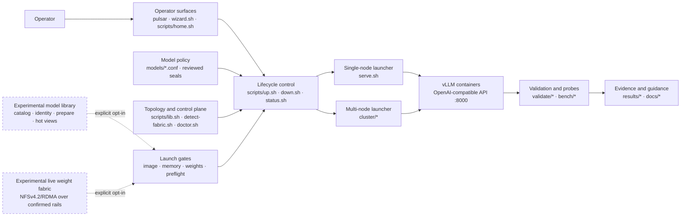

# Repository Guidelines

## Project Structure & Module Organization

This repository is an operations and validation stack for serving vLLM on NVIDIA DGX Spark GB10 systems. The preferred operator entry is `./pulsar` (home, wizard, start/stop/status). `serve.sh` and `cluster/*` are the low-level launchers. The control plane confirms an N-node topology; serving evidence currently validates one- and two-node geometries only. Model profiles are shell-style files under `models/`. Python benchmarks and correctness checks live in `validate/`, with measured artifacts in `results/` and hardware probes in `bench/`. Keep operational explanations in `docs/`; deprecated experimental overlays belong in `patches/`.

### Pulsar subsystem map

Solid arrows show the promoted control and evidence flow. Dashed arrows are
explicit experimental weight paths; neither is a silent fallback or wizard
default. Control SSH, inference NCCL/RoCE, and weight transfer remain distinct
data planes even when they involve the same machines.

## Build, Test, and Development Commands

- `scripts/selftest.sh` runs control-plane tests and Python syntax checks without requiring Docker.
- `scripts/doctor.sh` verifies GPU, Docker, port, cache, and optional worker readiness on GB10 hardware.
- `scripts/list-models.sh --validated --serving` lists wizard/operator ship profiles (`STATUS=tested*` and `PROFILE_PURPOSE=serving`). `--validated` alone also includes diagnostic canaries.
- `scripts/up.sh qwen3-1.7b --dry-run` exercises launch checks without starting a server.
- `validate/run-gates.sh <served-name> --tag <label>` runs determinism captures, throughput benchmarks, and optional baseline/needle gates against an already-running server.
- `docker build -t vllm-gb10:v0.26.0 .` builds the optional metadata overlay; see `docs/BUILD.md` before changing image pins.

## Coding Style & Naming Conventions

Write Bash for orchestration (`#!/usr/bin/env bash`, `set -euo pipefail`) and Python 3 for structured logic and validation utilities. Use two-space indentation in shell blocks and four spaces in Python. Quote shell expansions, prefer arrays for command construction, and add narrowly scoped ShellCheck suppressions with a reason. Use `lowercase-hyphenated.sh` for scripts, `snake_case.py` for Python, and descriptive model IDs such as `nemotron-3-nano-30b-nvfp4`. Preserve existing config key conventions (`UPPER_SNAKE_CASE`).

### Hybrid Bash + Python (what goes where)

This repo is intentionally hybrid. Match the existing pattern
(`weight-fabric.sh` + `weight_fabric.py`, `lib.sh` + small Python helpers):
**Bash at the operator boundary, Python for data and algorithms.** Do not
rewrite the control plane into one language, and do not introduce a third
language for new features without an explicit decision.

| Prefer **Bash** | Prefer **Python 3** |
|---|---|
| Operator CLIs and entrypoints (`scripts/*.sh`, `cluster/*.sh`, wizard/home) | JSON schemas, catalogs, digests, budgets, identity keys, merge/label logic |
| `source lib.sh`, `load_conf`, topology load, flag parsing | Multi-step planning, validation, fail-closed policy decisions |
| SSH orchestration, `rsync`/`docker` argv assembly, sudo/interactive flows | Atomic read/write of site-local state files (catalog, stamps, audits) |
| Thin wrappers that call Python and print human-oriented status | Machine-oriented `--json` structures and stable error codes/messages |
| Lifecycle glue (`up` / `down` / preflight hooks) | Unit-testable pure logic and fixture generation under `scripts/testlib/` |

**Boundaries**

- One module should own each schema (usually Python). Bash must not hand-edit
  complex JSON with `sed`/`awk` when a Python helper already exists or belongs.
- Reuse topology and SSH identity rules from shared helpers; do not reimplement
  confirmed-endpoint selection in a one-off Python script.
- Profile confs remain shell-style under `models/`; Bash may `load_conf` and
  pass `MODEL` / `NODES` / `STATUS` into Python as args or a small JSON dump.
  `EXPECTED_MODEL_SEAL` is only a reviewed repository-relative reference under
  `models/seals/`; `scripts/model_identity.py` owns its strict schema and
  identity validation. Bash and operator-local state must never manufacture or
  rewrite reviewed expected seals. `scripts/model-release.sh` may assemble only
  explicitly unreviewed candidates under gitignored
  `experiments/release-candidates/` (or an explicit path outside the repo); it
  must not write trust roots, edit profiles, or change validation status.
  `scripts/model_serving_release.py` separately owns ADR 0004 release and
  contract schema version 1. Keep it pure and non-issuing; later persistence
  layers must validate through it rather than duplicating its identity rules.
- New multi-node library/fabric-style features: thin `scripts/<name>.sh` CLI +
  `scripts/<name>.py` (or a small package) for the brain—same shape as weight
  fabric.
- Selftests follow the same split: Bash scenarios invoke CLIs; Python owns
  fixture builders and parameterized mocks (see Testing Guidelines).

**Avoid**

- Pure Bash for large indexes, digests, budgets, or all-or-nothing multi-rank
  barriers (hard to test; tends to rot).
- A parallel Python-only control plane that bypasses `lib.sh` topology/lifecycle
  without a strong reason.
- Go/Rust/other binaries for ops glue unless the project explicitly adopts a
  new toolchain for all Sparks.

## Command-Line Experience

Treat human-readable command-line output as a primary product requirement. Optimize interactive and human-facing output for fast scanning with clear information hierarchy, semantic line breaks, hanging indentation, consistent labels, and readable behavior at narrow terminal widths. Avoid dense key/value streams, uncontrolled wrapping, and meaning conveyed by color alone. Keep machine-readable output, such as JSON, separate and stable. For every CLI-facing change, review the rendered human output explicitly and test representative narrow terminal widths.

## Testing Guidelines

Run `scripts/selftest.sh` for every script or config change. Changes affecting serving behavior must also follow `docs/REVALIDATE.md`; record reproducible outputs under `results/` and update `docs/VALIDATION.md`. There is no percentage coverage target: promotion depends on correctness, determinism, benchmark, long-context, and soak evidence appropriate to the change.

### Selftest structure (avoid spaghetti mocks)

Control-plane selftests must stay maintainable. Do not grow monolithic
`scripts/selftest-*.sh` files by copy-pasting mock state machines or embedding
fixture site maps inside generic doubles.

**Layers**

1. **Scenario** (`scripts/selftest-<area>.sh`) — arrange → act → assert only;
   keep thin.
2. **Fixture** — topology, ranks, **roles** (owner/client/control), paths, and
   golden inputs. Fixtures name *who* is owner/client; they do not bury that in
   mock implementation.
3. **Mock / test double** — parameterized helpers under `scripts/testlib/` (or
   `scripts/testdata/` for static trees). Mocks accept kind, identity, and
   optional **role-driven** policy—not hard-coded hostnames.

**Rules**

- Prefer one shared mock helper over near-duplicate PATH/SSH/`cat` shims. If you
  need the same state machine a second time, extract it before extending.
- **Never** encode product roles as hostname branches in mocks (e.g.
  `if host = orion-client` ⇒ large TX). Pass `role=fabric-owner|fabric-client|…`
  (or an explicit delta map) from the fixture. Flipping owner rank must not
  require rewriting the mock.
- Prefer **Python** (or a small shared library) for fixture generation, digests,
  budgets, and multi-step mock logic. Use Bash for invoking CLIs under test,
  temp dirs, and exit-code checks. Stop growing selftests with large
  `python3 <<'PY' … write bash …` blobs that reinvent fixtures inline.
- Keep new feature areas in **their own** selftest module (e.g. model-library
  tests must not bolt onto `selftest-weight-fabric.sh`).
- Soft budget: if a `selftest-*.sh` approaches ~500 lines or a change adds a
  large paste of mock logic, split scenarios or extract `scripts/testlib/`
  helpers in the same PR (or a prerequisite cleanup PR).
- Production code may keep calling `cat`/SSH; the mock must not re-encode the
  site map. Assert product contracts (thresholds, digests, fail-closed paths),
  not the mock’s internal host table.

**Selftest PR checklist**

- [ ] New scenario reuses an existing helper, or adds one parameterized helper
- [ ] No new hostname→behavior branches in mocks
- [ ] Fixture documents owner/client (or equivalent) ranks/roles
- [ ] No unjustified multi-hundred-line growth of a single selftest file
- [ ] When fixing fabric/counter tests, prefer extracting
  `scripts/testlib/` mocks over another copy-paste path

When extending weight-fabric traffic proofs, use (or introduce) a single
parameterized counter mock (kind=`ib|netdev`, identity, role-driven deltas)
rather than additional parallel SSH/local state machines.

## Reliability, Safety, and Evidence

These rules exist because silent fallbacks, wrong networks, and unowned cleanup have caused real multi-node failures. Prefer failing loudly over “making it work.”

### Fail closed; no silent policy changes

- Partial weights, wrong transport, digest mismatch, stale topology, or incomplete preparation/start must **not** report healthy serving.
- Do **not** silently fall back (e.g. fabric → full N-replica pull, RoCE NFS → TCP/control-LAN NFS, confirmed rail → “any route”). If an alternate path exists, it is an **explicit** operator choice and must be visible in CLI, labels, and docs.
- Do **not** invent serving geometries (TP/PP/node counts) from “we discovered N machines.” Exact profiles and `STATUS` gates decide what may run; extra confirmed nodes stay idle capacity.
- Wizard and default paths stay on **promoted** behavior. Experimental features remain opt-in CLI (never surprise defaults).

### Topology, SSH, and data planes

- Treat confirmed topology (`.cluster-topology.json`) as membership truth—not mDNS names alone.
- Management SSH must use the **confirmed control endpoint** (saved alias for identity/host keys is fine; transport host must not wander onto a RoCE data rail). Reuse shared resolvers; do not reimplement per script.
- Keep planes distinct in code and docs: **control** (SSH, rendezvous), **inference** (NCCL/RoCE), **weight transfer** (library preparation / experimental fabric). Do not overload one path without saying so.
- Site-local state (`.cluster-topology.json`, `.weight-fabric/`, `.model-library/`, hot roots) is gitignored; never commit hostnames, IPs, or node IDs into publishable docs/results without redaction/audit patterns already used for fabric artifacts.
- In static hardware and measurement documentation, identify physical systems as
  `Node A`, `Node B`, and so on. Use generic rank labels such as `rank 0` and
  `rank 1` only when the runtime role itself matters; ranks are not durable
  hardware identities. Safety guidance may describe prohibited site identity
  generically, but must not quote stable site hostnames or durable topology
  identity.

### Lifecycle ownership

- Launchers own cleanup for containers **they** create (including signal traps on interrupt). Prefer immutable launch IDs and ownership-safe stop (`down.sh` / stack labels)—never broad `docker rm` of unrelated workloads.
- Destructive ops (purge hot, purge replicas, teardown exports, overwrite configs) are confirmation-gated; refuse when a managed service is still using the resource.
- Privileged changes require usable sudo policy; support attended `--interactive-sudo` where the project already does. **Never** read, log, transport, or store the operator password, and do not weaken sudoers to automate.
- All-or-nothing multi-rank steps (prepare, cluster start): on failure, roll back partial ranks or leave an explicit incomplete state that launch refuses—not a half-ready service.

### Claims, status, and artifacts

- Priority order for product decisions: **stability > accuracy > throughput > latency.**
- A **Model Serving Release** is the immutable combination of exact model
  identity, serving recipe, runtime/image identity, and supported hardware
  geometry defined by
  [ADR 0004](docs/decisions/0004-model-serving-release-validation.md). Any
  change to one of those four parts creates a new release; validation does not
  transfer across release IDs.
- The target decision statuses are `Untested`, `Testing incomplete`,
  `Tested—criteria not met`, `Tested—inconclusive`, `Validated`, and
  `Superseded`. `Validated` requires every frozen release-specific criterion
  across stability, accuracy, throughput, and latency, plus reviewed
  provenance/security and strict same-boot reproducibility. FP-equivalent
  output does not satisfy the strict gate.
- `scripts/model_serving_release.py` owns the pure ADR 0004 release-descriptor
  and frozen Validation Contract schemas. It does not issue reviewed objects,
  record results, assign status, or change serving eligibility. Current
  `STATUS=tested*`, `--validated`, expected seals, and schema-1 bundles remain
  legacy implementation contracts until the decision/status migration lands.
  Do not automatically relabel an existing profile or bundle `Validated`.
- `STATUS` / `docs/VALIDATION.md` / wizard allowlists change only with reproducible evidence. Preserve failed and partial runs; do not rewrite failures as passes.
- Selftests prove control-plane contracts; they do **not** replace physical gates for serving or storage claims (`docs/REVALIDATE.md`).
- Public `results/` bundles must stay free of secrets and private site values; use existing privacy-audit patterns when adding artifact publishers.
- Document dependency honesty: if a mode needs owner/home/library after start, inventory and docs say so; if independence is claimed, tests must cover home-down restart.

### Subsystem qualification boundaries

For model distribution and serving work, classify evidence before changing claims:

- **Catalog/artifact service:** exact bytes and identity, placement, transfer, runtime views, retention, repair, and cleanup.
- **Serving integration:** the selected image mounts and loads the intended exact source, then passes health, warmup, and completion smoke.
- **Model qualification:** accuracy, determinism, throughput, long context, and soak for the exact model/image/configuration/geometry.
- **Release/promotion:** every required subsystem result combined for a supported profile, wizard path, or default policy.

A failure in one subsystem does not erase valid evidence from another unless a
causal connection is demonstrated. It does block any combined claim that
requires both. Health or completion smoke is integration evidence, never model
qualification. An image/runtime change creates a new Model Serving Release and
invalidates applicable integration/model evidence; in the current schema it
also requires a new validation bundle. It does not automatically invalidate
unchanged catalog mechanics. Preserve failed evidence and state its scope.
Agents may propose a better boundary or causal model when new evidence warrants
it, but must not change the accepted policy, promotion requirements, or
interpretation as settled without explicit approval and an updated ADR. See
[ADR 0002](docs/decisions/0002-subsystem-qualification-boundaries.md),
[ADR 0004](docs/decisions/0004-model-serving-release-validation.md), and
`docs/REVALIDATE.md`.

### Model-library authority and invariants

For catalog, download, prepare, launch, pin, purge, or model-validation work,
read `docs/MODEL_LIBRARY_DESIGN.md` and the applicable record under
`docs/decisions/` before changing behavior. Authority descends from this file,
to the accepted design and decision records, to current implementation specs,
operator runbooks, and finally validation ledgers/evidence. Current code or a
new result does not silently override an accepted architectural decision.
Use `skills/change-pulsar-model-library/SKILL.md` as the repeatable workflow for
this work; the skill is procedural and does not outrank these sources.

- Use **prepare model for serving** and **model preparation** in operator-facing
  language. Preparation resolves, distributes, and verifies model files but does
  not start a container or establish model qualification. `activate` is a
  backward-compatible command and internal-schema term, not the product label.

- In the **current implementation**, a reviewed `STATUS=tested` identity binds
  a schema-1 validation bundle, not a model repository ID alone. Only issued
  seals (`qwen3-1.7b`, `deepseek-v4-flash` today) have that bundle. Other
  `tested` serving profiles remain `legacy-unsealed`. Expected identity comes
  from lab validation; locally observed content can match that identity but
  cannot create or replace it. Under ADR 0004, the implemented separate release
  descriptor owns the release ID and the implemented Validation Contract freezes
  its criteria. Run records, new evidence bundles, reviewed decisions, and
  status/serving projection remain pending.
- A deterministic release candidate has no authority by itself. Trusted
  issuance remains a reviewed change that binds lab evidence; candidate tools
  must fail if output claims review/promotion or targets trusted directories.
- The default library policy is one durable home per exact model revision.
  The home rank uses that durable tree through a validated symlink or equivalent
  rank-local view; **do not materialize a second hot copy on the home rank**.
- Reviewed upstream acquisition creates exactly one durable home: observe every
  confirmed rank, download the immutable commit on the selected target into
  same-filesystem private staging, recheck absence elsewhere, full-verify the
  expected seal, then publish atomically. The home must be one of the current
  profile's serving ranks so active storage remains one home plus N−1 hot
  copies. Do not silently choose another node,
  create a controller copy, refresh the catalog, prepare hot views, or launch.
- Only non-home ranks receive temporary or pinned sealed-hot copies. Symlinks
  and bind mounts are runtime views, not extra ownership or resilience.
- Full content verification happens at trust boundaries. A serve-time metadata
  witness may accelerate an unchanged launch only after full verification;
  drift causes visible full verification against the expected seal or fails
  closed. Never auto-reseal drift as validated content.
- Warm-home pinning retains non-home hot copies but still requires the durable
  home. Home-loss resilience and extra durable replicas are separate, explicit
  policies on distinct failure domains.
- When an operator explicitly chooses experimental reviewed-profile model
  preparation, use topology-bound `ssh-roce` copy with eight streams and no
  automatic fallback, as recorded in ADR 0003. This transport policy does not
  create a missing durable home, promote `library-hot`, or change the replicated
  guided default.
- Distribution transport is run provenance, not Model Serving Release
  identity. Experimental distribution subsystems are allowed when explicitly
  selected, but qualification starts only after exact content and the intended
  runtime-access contract verify on every serving rank. A failure before that
  barrier is failed preparation and leaves the release `Untested`.
- Preserve historical evidence and mark it superseded rather than rewriting it.
  A contract change must update the canonical design, implementation spec,
  operations, validation ledger, and evidence index together.

### Operational hygiene

- Prefer atomic writes for site-local JSON/state (write temp + rename).
- Idempotent setup where practical; incomplete rollback must be explicit and recoverable (`teardown` / purge / prepare again).
- Human CLI output remains a product surface (see Command-Line Experience); keep `--json` stable for automation.
- Scope PRs tightly: one concern per change; do not mix experimental fabric promotion with unrelated refactors.

## Commit & Pull Request Guidelines

**Branch and merge policy:** Do all work on a feature or fix branch. Do **not**
commit or push directly to `main`. Land changes only by opening a pull request
and merging through review—never force-push or fast-path commits onto `main`
outside that process.

**Automatic publication after completed work:** Completion of a planned unit of
work is standing authorization to publish that unit. Once its relevant checks
pass, agents must not wait for a separate commit, push, or pull-request request.
They must:

1. Stage every change that belongs to the completed unit, including its tests,
   documentation, and sanitized evidence.
2. Commit the complete unit with a focused message.
3. Push the current feature or fix branch to `origin`.
4. Open a ready-for-review pull request against the default branch.

`Commit all` means all completed **in-scope** work. It never includes unrelated
user changes, secrets, site-local state, model data, or unsanitized raw evidence.
If a mixed worktree cannot be separated safely, stop and ask. Do not publish
known-incomplete or failing work as ready, and do not merge, force-push, or
bypass review without explicit authorization.

History favors concise imperative subjects, usually Conventional Commit style: `fix(memory): ...`, `feat(serve): ...`, or `docs(patches): ...`. Keep commits focused. Pull requests should explain affected models and hardware paths, link relevant issues, list commands run, and include result artifact paths. Highlight image/config changes and any behavior not validated on physical GB10 hardware. Call out fail-closed behavior, new fallbacks (there should be none silent), and whether hardware validation was run or is still required.

## Security & Configuration

Never commit `.env`, API/Hugging Face tokens, SSH keys, or model weights. The API binds to `0.0.0.0:8000`; keep it on a trusted lab network or configure `VLLM_API_KEY` and an authenticating proxy. Do not embed credentials in scripts, logs, or artifacts. Report vulnerabilities privately as described in `SECURITY.md`.
