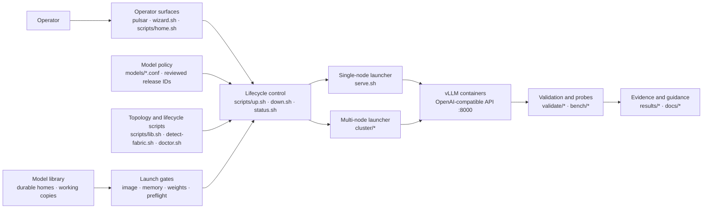

# Repository Guidelines

## Project Structure & Module Organization

This repository is an operations and validation stack for serving vLLM on NVIDIA DGX Spark GB10 systems. The preferred operator entry is `./pulsar` (menu, wizard, start/stop/status). For now, that surface consumes the in-repo catalog; recipe craft and onboarding stay maintainer tooling ([ADR 0010](docs/decisions/0010-operator-consumes-catalog.md)). `serve.sh` and `cluster/*` are the low-level launchers. Scripts that start, stop, and check without running the model confirm an N-node topology; serving evidence currently covers one- and two-node geometries only. Model profiles are shell-style files under `models/`. Python benchmarks and correctness checks live in `validate/`, with measured artifacts in `results/` and hardware probes in `bench/`. Keep operational explanations in `docs/`; deprecated experimental overlays belong in `patches/`.

### Pulsar subsystem map

The model library is the only weight-distribution mechanism
([ADR 0006](docs/decisions/0006-model-library-only-weight-distribution.md)):
one durable home per exact revision, working copies on other serving ranks, and
local files on every rank before vLLM starts. There is no mode-selection
axis; `--weight-source`/`--weight-mode` fail without fallback. Live NFSv4.2/RDMA under
vLLM remains rejected as a serving runtime source (ADR 0005): a crashed rank
cannot cold-start without the NFS export; leftover site mounts get
unmount/teardown only. Control SSH, inference NCCL/RoCE, and the copy path
used at prepare remain distinct data planes even when they involve the same machines.

## Build, Test, and Development Commands

- `scripts/selftest.sh` runs lifecycle-script tests and Python syntax checks without requiring Docker.
- `scripts/doctor.sh` verifies GPU, Docker, port, cache, and optional worker readiness on GB10 hardware.
- `scripts/list-models.sh --serving` lists every serving-purpose profile and the reviewed status the catalog shows (start does not use that status as permission). `--legacy-tested` filters the historical profile `STATUS=tested*` recommendation class; it does not mean ADR 0004 `Validated`. `--validated` is removed (ADR 0008) and fails without fallback; use `--legacy-tested`.
- `scripts/up.sh nemotron-3-nano-30b-nvfp4 --dry-run` exercises launch checks without starting a server.
- `validate/run-gates.sh <served-name> --tag <label>` runs determinism captures, throughput benchmarks, and optional baseline/needle gates against an already-running server.
- `docker build -t vllm-gb10:v0.26.0 .` builds the optional metadata overlay; see `docs/BUILD.md` before changing image pins.

## Coding Style & Naming Conventions

Write Bash for orchestration (`#!/usr/bin/env bash`, `set -euo pipefail`) and Python 3 for structured logic and validation utilities. Use two-space indentation in shell blocks and four spaces in Python. Quote shell expansions, prefer arrays for command construction, and add narrowly scoped ShellCheck suppressions with a reason. Use `lowercase-hyphenated.sh` for scripts, `snake_case.py` for Python, and descriptive model IDs such as `nemotron-3-nano-30b-nvfp4`. Preserve existing config key conventions (`UPPER_SNAKE_CASE`).

### Hybrid Bash + Python (what goes where)

This repo is intentionally hybrid. Match the existing pattern
(`model-library.sh` + `model_library.py`, `lib.sh` + small Python helpers):
**Bash at the operator boundary, Python for data and algorithms.** Do not
rewrite the lifecycle scripts into one language, and do not introduce a third
language for new features without an explicit decision.

| Prefer **Bash** | Prefer **Python 3** |
|---|---|
| Operator CLIs and entrypoints (`scripts/*.sh`, `cluster/*.sh`, `wizard.sh`, `home.sh`) | JSON schemas, catalogs, digests, budgets, identity keys, merge/label logic, launch-plan/probe contracts (`launch_plan.py`) |
| `source lib.sh`, `load_conf`, topology load, flag parsing | Multi-step planning, validation, policy decisions that fail without fallback |
| SSH orchestration, `rsync`/`docker` argv assembly, sudo/interactive flows | Atomic read/write of site-local state files (catalog, stamps, audits) |
| Thin wrappers that call Python and print human-oriented status | Machine-oriented `--json` structures and stable error codes/messages |
| Lifecycle glue (`up` / `down` / preflight hooks) | Unit-testable pure logic and fixture generation under `scripts/testlib/` |

**Boundaries**

- One module should own each schema (usually Python). Bash must not hand-edit
  complex JSON with `sed`/`awk` when a Python helper already exists or belongs.
  `scripts/launch_plan.py` owns the versioned launch-plan, serving-probe, and
  rank-spec contracts. `scripts/up.sh`, `serve.sh`, and
  `cluster/start-cluster.sh` build the same plan from loaded profile plus
  topology plus prepared local-file facts; N=1 and N>1 docker argv come from
  `rank_docker_argv`. A plan describes an intended serve action; it is not a
  permit. Mutable image, identity, topology, ownership, and health
  prerequisites still require an immediate recheck before mutation.
  `scripts/inventory.sh` is the only operator-facing ownership/state
  classifier; launchers consume proven-ownership primitives from `lib.sh`.
- Reuse topology and SSH identity rules from shared helpers; do not reimplement
  confirmed-endpoint selection in a one-off Python script.
- Profile confs remain shell-style under `models/` (2026-08-22:
  declarative TOML is rejected; parser unification may happen later without
  a format change). Bash may `load_conf` and
  pass `MODEL` / `NODES` / `STATUS` into Python as args or a small JSON dump.
  `EXPECTED_MODEL_SEAL` is retired (ADR 0012): `load_conf` fails without
  fallback if a conf sets it. `scripts/model_identity.py` owns the live
  normalized-profile checksum format, not the retired lab expected-identity
  files. Do not manufacture those files or the archived combined identity
  format. `scripts/model-release.sh` is removed.
  `scripts/model_serving_release.py` separately owns ADR 0004 Model Serving
  Release and Validation Contract objects. `scripts/model-serving-release-plan.sh`
  may source a profile and assemble/verify only draft release/contract JSON
  that is not in the trusted registry, under gitignored
  `experiments/model-onboarding/` (or an explicit path outside the repo). It
  must require a complete file list plus explicit runtime/hardware and criteria
  inputs and explicit one-to-one pointers for every supplied additional
  behavior artifact, and strip local source paths. It must not acquire bytes,
  write the tracked registry, issue a decision, change status, or claim
  physical behavior. Planner `verify` uses the public schema-owning
  `load_verified_release_plan_candidate(dir)` loader after shared filesystem
  hardening. Planner and capture publish candidate JSON with the shared
  `pretty_json_bytes` encoding from `scripts/model_identity.py` (`indent=2`,
  `sort_keys=True`, `ensure_ascii=False`, trailing newline); identity digests
  remain compact `canonical_json_digest`.
  `scripts/immutable_descriptor_dir.py` owns only generic descriptor-rooted
  immutable-directory primitives and is not a schema owner. A local
  profile-reference mapping may normalize an exact argument
  value to a bound public artifact key, but the mapping itself must never be
  persisted. `scripts/model_validation_evidence.py` owns the
  evidence-artifact, run-record, evidence-bundle, and reviewed-decision
  formats. Keep both modules pure and non-issuing. They do not write the
  trusted registry or merge a PR.
  `scripts/model_serving_release_registry.py` owns read-only
  filesystem loading, content verification, graph assembly, and inspection of
  stored ADR 0004 objects under `models/model-serving-releases/`; its verified
  inspection result is the only source for the reviewed status the catalog
  shows. Profiles may set the optional reviewed `MODEL_SERVING_RELEASE_ID`
  field so that display points at one reviewed subject (exact model + recipe +
  image + hardware). Changing any of those four parts must update the field to
  the newly derived release ID in the same reviewed change. Runtime display
  additionally checks the selected model-access contract, but does not
  independently reconstruct the four parts from shell profile fields.
  `scripts/model-serving-release-capture.sh` owns local ADR 0004
  evidence-capture draft persistence: it composes a verified release-plan
  draft plus an attempt-only spec, independently validates Model Serving
  Release and Validation Contract objects through
  `scripts/model_serving_release.py`, captures
  immutable run records and hashed evidence, assembles compatible
  runs, and independently verifies the draft. It must not write
  the tracked registry, issue a decision, change catalog or profile status,
  start a server, persist a planner path or planner candidate ID, or issue
  `Untested`.
  `scripts/model-serving-release-issue.sh` owns maintainer-only ADR 0004
  staging: it turns one independently verified draft capture directory plus an
  explicit review declaration into a staged proposal of the exact hashed
  registry objects and any privacy-cleared publishable evidence. The existing
  pure schema modules derive the decision status. A successful local command
  does not make the objects trusted; repository review and merge do. It must
  not mutate the capture directory, edit a profile, authorize serving, or claim
  physical behavior. Status remains display-only and does not grant or deny
  start.
  Evidence-bundle field `review_evidence_artifact_ids` lists extra review files
  besides the measurement runs, not a second copy of compare/bench. Empty after
  measurement capture is expected. A decision may cite an empty list only when
  every provenance/security component is `pending`. Do not recapture a
  maintainer essay to populate the list. `Validated` still requires a
  provenance pass with cited extra review files for provenance and geometry
  review. Do not invent review evidence.
  `skills/pulsar-model-serving-release-issuance/` is the supervised
  maintainer skill that composes that CLI after onboarding handoff. It cannot
  make the objects trusted: `plan` is read-only, `stage` is an untrusted
  proposal, and repository review and merge remain what establishes trust. It
  does not mutate a capture directory, invent a review outcome, keep an
  orchestration journal, or set `MODEL_SERVING_RELEASE_ID` except as a
  separately confirmed edit in the same publication PR. Deterministic skill
  tests make no physical DGX claim.
  `validate/validator_measurement.py` owns the closed, versioned, status-neutral
  measurement documents emitted by `validate/compare_captures.py`,
  `validate/bench_serve.py`, `validate/gsm8k_eval.py`, and `validate/soak.py`.
  It also owns the `observe-resources` diagnostic
  emitted by the experiment-only
  `scripts/model-serving-experiment-monitor.sh` boundary. That monitor samples
  each exact serving rank only during supervised physical onboarding: after
  the all-rank verification barrier, before qualifying launch, through the
  final owned stop. Raw samples stay under gitignored
  `experiments/model-onboarding/workflows/`; privacy-safe per-attempt summaries
  under `results/` are run evidence only. They do not satisfy criteria, change
  attempt completion or status, populate `review_evidence_artifact_ids`, or
  enter Model Serving Release identity. A missing closed summary is an
  explicit capture gap. Never call this monitor from `pulsar`, `wizard.sh`,
  `up.sh`, `serve.sh`, `cluster/*`, status/inventory, catalog projection, or
  ordinary serving after issuance.
  `scripts/model_serving_release_attempt.py` owns the
  closed attempt context and invocation-plan schemas plus mapping of those
  measurements into existing attempt-only specs. It may consume only the
  supported publishable `results/` measurement files in this slice, must
  validate every generated spec through the capture contract, and may publish
  only one exclusive draft directory under
  `experiments/model-serving-release-attempts/` (or an explicit safe path
  outside the repository). It must not invent missing validator output, persist
  a publishable evidence digest in the attempt spec, issue a decision, change
  status, authorize serving, or claim physical behavior. Later capture must
  independently re-read the evidence and derive its digest; regenerate the
  attempt specs if that file changes between commands.
  Each supervised measurement attempt also requires one closed
  `observe-resources` summary with the exact attempt window and scope. The
  attempt-only spec lists that source in `run_diagnostic_source_keys`; capture
  binds it into the run's existing evidence set, never a criterion observation
  or review-evidence list.
  `skills/pulsar-model-onboarding/` is the ADR 0004 stage-4 supervised
  onboarding skill. It composes those existing CLIs for a brand-new model and
  collaborates at material decisions. It never writes a lab expected-identity
  file or a validation decision, assigns status, points a profile at a Model
  Serving Release, writes the trusted registry, promotes a path, or claims
  physical behavior.
  `skills/pulsar-model-onboarding/scripts/onboarding_journal.py` owns only the
  skill-local append-only workflow journal (orchestration recovery state).
  It is not a sixth ADR object, not evidence, and not a status authority.
  Default local journal state belongs under gitignored
  `experiments/model-onboarding/workflows/`, separate from release-plan
  draft directories. For an absent brand-new repository, the
  skill may compose `home add --revision` (Hugging Face download with a
  recorded file list and hashes): first a read-only plan, then a separately
  confirmed exact-commit acquisition. The
  service resolves and records the complete public Hugging Face Git/LFS
  inventory on the selected rank, uses that rank's local authentication,
  confines downloads and transient caches to private same-filesystem staging,
  verifies the upstream set and every SHA-256, rechecks all-rank absence,
  writes an immutable site-local receipt, publishes with an atomic
  no-replace rename, and records that live directory as the home.
  It does not refresh the catalog,
  prepare a runtime view, launch, or create reviewed authority. A home
  created this way may later be resumed or reused only after `home verify`
  completes an offline full rehash against the receipt while occupancy names
  that live directory. Occupancy may move with `home relocate --node` after
  that same live rehash; receipt `selected_rank` is Hub-download provenance
  only ([ADR 0011](docs/decisions/0011-portable-occupancy-and-cold-archive.md)).
  A byte-identical receipt replica and a separate receipt-indexed
  model archive are enqueued immediately after occupancy attach and must not
  block prepare or launch. The receipt replica belongs under the separate cold
  control-state namespace, never inside the model archive. The configured cold
  root inherits the operator's access-control policy; Pulsar does not enforce
  ownership, modes, or ACLs there
  ([ADR 0016](docs/decisions/0016-operator-owns-cold-storage-access-control.md)).
  Last occupancy
  removal verifies both. A missing controller receipt is recovered only by the
  explicit confirmation-gated receipt recovery command; archived bytes and
  `presence.json` cannot create or authorize a receipt
  ([ADR 0013](docs/decisions/0013-separate-receipt-control-replica.md)). The
  operator owns whether the configured cold root is a suitable independent
  failure domain. Pulsar checks path safety and recovery-set integrity, not
  device, mount, filesystem, export, or storage-domain independence
  ([ADR 0014](docs/decisions/0014-operator-owns-cold-storage-failure-domain.md)).
  Live recovery configuration is explicit `PULSAR_COLD_ROOT` only: process,
  then persisted repository `.env`, then `not-configured`. Empty disables.
  There is no live `MODELS_NFS` alias and no implicit `/mnt/Models`
  fallback
  ([ADR 0015](docs/decisions/0015-explicit-cold-recovery-root.md)).
  Operators configure that path through `./pulsar configure cold-storage`.
  The selected directory must already exist; Pulsar does not create, mount,
  or administer it. Existing non-Pulsar content stays untouched. The cold root
  is not a launch-plan field and is never mounted into a serving container.
  An unknown tree without a receipt fails without fallback (ADR 0012: there is
  no lab expected-identity fallback). The shallow catalog label and a
  self-observed file list are not that proof. The skill must never download
  directly into durable storage.
  Deterministic skill and journal tests make no physical DGX claim and create
  no Model Serving Release decision.
  `scripts/model_library_receipt.py` owns the closed Hugging Face
  source, identity, public plan, privacy-safe approval, immutable
  receipt, private current-home attachment, result, and home-verification
  formats for that path. The thin Bash
  boundary selects the target and orchestrates its local `hf` CLI;
  `scripts/hf_source_inventory.py` uses the target's Hugging Face Python
  environment to resolve public source metadata without accepting a token.
  That download creates observed/source identity and “did we store the right
  files?” evidence only. It does not issue reviewed identity, a lab
  expected-identity file, status, serving permission, a Model Serving Release
  decision, or physical evidence. Prepare requires occupancy plus the exact
  model ID, exact commit, and receipt file list together. A self-observed
  file list is not that proof.
- New multi-node library features: thin `scripts/<name>.sh` CLI +
  `scripts/<name>.py` (or a small package) for the brain—same shape as other
  library CLIs.
- Selftests follow the same split: Bash scenarios invoke CLIs; Python owns
  fixture builders and parameterized mocks (see Testing Guidelines).

**Avoid**

- Pure Bash for large indexes, digests, budgets, or all-or-nothing multi-rank
  barriers (hard to test; tends to rot).
- A parallel Python-only lifecycle layer that bypasses `lib.sh` topology/lifecycle
  without a strong reason.
- Go/Rust/other binaries for ops glue unless the project explicitly adopts a
  new toolchain for all Sparks.

## Command-Line Experience

Treat human-readable command-line output as a primary product requirement. Optimize interactive and human-facing output for fast scanning with clear information hierarchy, semantic line breaks, hanging indentation, consistent labels, and readable behavior at narrow terminal widths. Avoid dense key/value streams, uncontrolled wrapping, and meaning conveyed by color alone. Keep machine-readable output, such as JSON, separate and stable. For every CLI-facing change, review the rendered human output explicitly and test representative narrow terminal widths.

### Plain technical language

Lead with what happens, what it affects, and the condition that causes it.
Use a name only when the thing is a durable product object or an unavoidable
cluster term. On first use, gloss it in ordinary words. Do not invent a
nickname when a short description is enough.

**Keep these names** (gloss on first use; do not replace them with approximate
synonyms that change meaning):

- **Model Serving Release** — exact model bytes + serving recipe + image +
  hardware shape, frozen together
- **Validation Contract** — the frozen list of tests and thresholds for that
  subject
- **home** — the one complete on-disk copy of that revision (not the `./pulsar`
  menu, not the NFS export node)
- **prepare** — copy or link local files and hash them; does not start the server
- **rank** — this job's slot in the serving group (rank 0 is the API; not
  automatically the home node)
- **receipt** — the recorded download file list and hashes
- **witness** — saved file metadata so an unchanged tree is not fully rehashed
  at start
- **pin / purge** — keep / delete working copies (not a backup)
- ADR 0004 decision strings, quoted exactly (`Untested`, `Testing incomplete`,
  `Tested—criteria not met`, `Tested—inconclusive`, `Validated`, `Superseded`)
- **fail without fallback** — the operation fails if the required condition
  cannot be verified, and it does not skip the check, remap, or continue on a
  weaker path

Accepted ADRs may still say `fail closed`; in new operator-facing text, use
fail without fallback.

**Do not use these as live brands.** Describe the thing:

- `library-hot` → local files on every rank, prepared from the model home
  (new writes use `local-files`; leftover labels are not dual-read)
- `source-attested` → Hugging Face download with a recorded file list and hashes
  (new writes use `identity_class=download-receipt`, `download-receipts/`, and
  `home-occupancy/`)
- `advisory projection` / `binding` → the catalog shows the reviewed status;
  start does not use it as permission; `MODEL_SERVING_RELEASE_ID` points at one
  reviewed subject
- `issuance` / `trust event` → write staged registry files vs merge the PR
- `unreviewed candidate` → draft JSON that is not in the trusted registry yet
- `leftover` for review files → extra review files besides the measurement runs
  (`review_evidence_artifact_ids`)
- `flagship`, `plumbing canary`, `GA`, `federated`, `guided default`,
  `operator home`, `four-part tuple`, `qualification barrier`
- ticket IDs (`SIM-…`) as product terms — cite the behavior or ADR; tickets
  are tracking
- public `activate` — the command is `prepare`

**Do not say “sealed” or “unsealed” for live admission.** Working copies on
nodes that do not hold the home are working copies
(`runtime_source=working-copy`). Live file identity is the receipt plus
occupancy path (`identity_status=receipt-occupancy`). Lab expected-identity
files are archive-only (ADR 0012).

**Never say “schema N” without the kind.** Operator text should not mention
schema numbers unless the reader is editing JSON. ADR 0004 objects, the
retired expected-identity format, catalog records, and working-copy records
are different formats that happen to number independently.

**Never say “validated” or “tested” without saying which ladder:**
profile `STATUS=tested` (old recommendation class), an ADR 0004 decision, or
launch `identity_status`. `FAMILY_RECOMMENDED` / `RECOMMENDED_SPEC` are wizard
sort flags, not a third status.

**Never shorten Model Serving Release to “the release”** next to staging
commands, evidence scopes, or tearing down a copy plane. The ADR 0004 evidence
bundle is not the archived combined identity file. In prose call the evidence
scope `release-promotion` “provenance and geometry review.”

**Archive-only nouns** (history, refuse-paths, leftover files): expected-seal,
`EXPECTED_MODEL_SEAL`, `identity_status=match`, `validation-bundle verify`,
`model-release.sh`, weight fabric, live-mount. Do not teach them as live
product.

- Prefer concrete wording such as "preparation fails if the model identity
  cannot be verified."
- Explain scope words such as "bounded," "reviewed," and "two-rank" when their
  practical limits may not be obvious.
- Avoid dense noun phrases, unexplained abbreviations, and implementation terms
  when a direct description communicates the same behavior.
- Never simplify wording in a way that changes an agreed definition,
  validation requirement, authority boundary, or status meaning.

### Name the object in status language

When reporting a decision, always name what the verb applies to: the
product path, the Linear issue, the PR, or the milestone. Do not use a
bare verb (“keep”, “close”, “remove”, “done”) next to a ticket id if it
could mean either the feature or the tracking item.

- Say “the product path keeps Hugging Face `home add --revision`;
  SWI-747 is already Done.”
- Do not say “SIM-02/03: already implemented / keep.”
- “Keep” means the product path stays. “Leave open” / “already Done”
  is for Linear. Never use “keep” for ticket state.
- If no new issue is filed, say why in one sentence: the path was
  already deleted, or the decision was to retain the path.

## Testing Guidelines

Use this testing cadence:

1. During iteration: run only directly affected tests.
2. After completing a coherent change: run relevant subsystem suites.
3. Before commit/publication: run the full selftest once.

The full suite is `scripts/selftest.sh` and remains required in CI. Directly
affected tests and relevant subsystem suites may be invoked individually until
dedicated aggregate entrypoints exist. Changes affecting serving behavior
must also follow `docs/REVALIDATE.md`; record reproducible outputs under
`results/` and update `docs/VALIDATION.md`. There is no percentage coverage
target: promotion depends on correctness, determinism, benchmark, long-context,
and soak evidence appropriate to the change.

### Selftest structure (avoid spaghetti mocks)

Lifecycle-script selftests must stay maintainable. Do not grow monolithic
`scripts/selftest-*.sh` files by copy-pasting mock state machines or embedding
fixture site maps inside generic doubles.

**Layers**

1. **Scenario** (`scripts/selftest-<area>.sh`) — arrange → act → assert only;
   keep thin.
2. **Fixture** — topology, ranks, **roles** (export-owner/client/control), paths, and
   golden inputs. Fixtures name *who* is export-owner/client; they do not bury that in
   mock implementation.
3. **Mock / test double** — parameterized helpers under `scripts/testlib/` (or
   `scripts/testdata/` for static trees). Mocks accept kind, identity, and
   optional **role-driven** policy—not hard-coded hostnames.

**Rules**

- Prefer one shared mock helper over near-duplicate PATH/SSH/`cat` shims. If you
  need the same state machine a second time, extract it before extending.
- **Never** encode product roles as hostname branches in mocks (e.g.
  `if host = orion-client` ⇒ large TX). Pass `role=fabric-owner|fabric-client|…`
  (or an explicit delta map) from the fixture. Flipping owner rank must not
  require rewriting the mock.
- Prefer **Python** (or a small shared library) for fixture generation, digests,
  budgets, and multi-step mock logic. Use Bash for invoking CLIs under test,
  temp dirs, and exit-code checks. Stop growing selftests with large
  `python3 <<'PY' … write bash …` blobs that reinvent fixtures inline.
- Keep new feature areas in **their own** selftest module (e.g. model-library
  tests must not bolt onto an unrelated suite).
- Soft budget: if a `selftest-*.sh` approaches ~500 lines or a change adds a
  large paste of mock logic, split scenarios or extract `scripts/testlib/`
  helpers in the same PR (or a prerequisite cleanup PR).
- Production code may keep calling `cat`/SSH; the mock must not re-encode the
  site map. Assert product contracts (thresholds, digests, paths that fail without fallback),
  not the mock’s internal host table.

**Selftest PR checklist**

- [ ] New scenario reuses an existing helper, or adds one parameterized helper
- [ ] No new hostname→behavior branches in mocks
- [ ] Fixture documents export-owner/client (or equivalent) ranks/roles
- [ ] No unjustified multi-hundred-line growth of a single selftest file
- [ ] When fixing fabric/counter tests, prefer extracting
  `scripts/testlib/` mocks over another copy-paste path

When extending traffic-proof tests, use (or introduce) a single
parameterized counter mock (kind=`ib|netdev`, identity, role-driven deltas)
rather than additional parallel SSH/local state machines.

## Reliability, Safety, and Evidence

These rules exist because silent fallbacks, wrong networks, and unowned cleanup have caused real multi-node failures. Prefer failing loudly over “making it work.”

### Independent external review and approved implementation

When a user requests an independent external review or delegated
implementation, use a locally installed reviewer skill when one is available.
The first pass stays read-only against a
privacy-cleared root: a tracked-files-only tree for review-only work, or a clean
dedicated feature worktree when approved implementation is anticipated.
Reconcile its findings against repository authority and obtain explicit
agreement before editing. After approval, the reviewer may resume the same session in
the same preflighted worktree with implementation permissions, and may run
in-scope local tests or bounded subagents. Use a fresh compact handoff instead
when the review is large, the head or scope changed, or review used a temporary
tracked-only tree. The primary agent reviews the resulting diff and
authoritative test results without needlessly reimplementing the change, and
retains commit and publication responsibility. A temporary worktree branch may
be pushed by normal refspec to the original remote PR branch; never force a
concurrent update, and fast-forward the original local worktree afterward only
when its tracked state is clean. The reviewer must not receive secrets or
site-local state, expand policy or scope without approval, or operate
external/privileged infrastructure unless that authority is explicitly part of
the approved plan.

### Fail without fallback; no silent policy changes

- Partial weights, wrong transport, digest mismatch, stale topology, or incomplete preparation/start must **not** report healthy serving.
- Do **not** silently fall back (e.g. missing durable home → ad-hoc download, ssh-roce rail → control-LAN copy, confirmed rail → “any route”). If an alternate path exists, it is an **explicit** operator choice and must be visible in CLI, labels, and docs.
- Do **not** invent serving geometries (TP/PP/node counts) from “we discovered N machines.” Exact profile contracts and operational gates decide what can run; extra confirmed nodes stay idle capacity.
- The wizard exposes all serving profiles that fit confirmed capacity, with status and material caveats visible. Recommendation and default ordering prefer evidence-backed behavior. Experimental subsystems remain explicit choices and are never silent fallbacks.

### Topology, SSH, and data planes

- Treat confirmed topology (`.cluster-topology.json`) as membership truth—not mDNS names alone.
- Management SSH must use the **confirmed control endpoint** (saved alias for identity/host keys is fine; transport host must not wander onto a RoCE data rail). Reuse shared resolvers; do not reimplement per script.
- Keep planes distinct in code and docs: **control** (SSH, rendezvous), **inference** (NCCL/RoCE), **weight transfer** (library preparation). Do not overload one path without saying so.
- Site-local state (`.cluster-topology.json`, `.weight-fabric/`, `.model-library/`, hot roots) is gitignored; never commit hostnames, IPs, or node IDs into publishable docs/results without redaction/audit patterns already used for fabric artifacts.
- `scripts/check_publishable_privacy.py` is the canonical privacy gate. Run it
  on the working tree before publication and with `--staged` before commit;
  staged mode reads index blobs so partial staging cannot hide committed bytes.
  It must reject hostnames, addresses, SSH identity, durable node/topology
  identity, user paths, and credential material without treating generic ranks,
  `Node A` / `Node B`, loopback, or RFC documentation addresses as site
  identity.
- When asked to commit, use `skills/pulsar-safe-commit/`. The tracked
  `.githooks/pre-commit` is optional local defense in depth; hooks are not CI
  authority and must not replace the full selftest privacy gate.
- In static hardware and measurement documentation, identify physical systems as
  `Node A`, `Node B`, and so on. Use generic rank labels such as `rank 0` and
  `rank 1` only when the runtime role itself matters; ranks are not durable
  hardware identities. Safety guidance may describe prohibited site identity
  generically, but must not quote stable site hostnames or durable topology
  identity.

### Lifecycle ownership

- Launchers own cleanup for containers **they** create (including signal traps on interrupt). Prefer immutable launch IDs and ownership-safe stop (`down.sh` / stack labels)—never broad `docker rm` of unrelated workloads.
- Destructive ops (purge hot, purge replicas, teardown exports, overwrite configs) are confirmation-gated; refuse when a managed service is still using the resource. Ordinary stop of a model-library service retains unpinned prepared views ([ADR 0007](docs/decisions/0007-ordinary-stop-retains-unpinned-hot-views.md)); `--purge-hot` is the explicit capacity-recovery action.
- Privileged changes require usable sudo policy; support attended `--interactive-sudo` where the project already does. **Never** read, log, transport, or store the operator password, and do not weaken sudoers to automate.
- All-or-nothing multi-rank steps (prepare, cluster start): on failure, roll back partial ranks or leave an explicit incomplete state that launch refuses—not a half-ready service.

### Claims, status, and artifacts

- Priority order for product decisions: **stability > accuracy > throughput > latency.**
- A **Model Serving Release** is the immutable combination of exact model
  identity, serving recipe, runtime/image identity, and supported hardware
  geometry defined by
  [ADR 0004](docs/decisions/0004-model-serving-release-validation.md). Any
  change to one of those four parts creates a new release; validation does not
  transfer across release IDs.
- Its primary artifact identity is source-neutral: use `huggingface-snapshot`
  for an exact Hugging Face commit and full manifest, or
  `content-addressed-model` for another complete model tree with a public
  logical ID, public revision, and full manifest. Never persist a local source
  path. A generic `digest-artifact` cannot be the primary model.
- The target decision statuses are `Untested`, `Testing incomplete`,
  `Tested—criteria not met`, `Tested—inconclusive`, `Validated`, and
  `Superseded`. `Validated` requires every frozen release-specific criterion
  across stability, accuracy, throughput, and latency, plus reviewed
  provenance/security and strict same-boot reproducibility. FP-equivalent
  output does not satisfy the strict gate.
- Validation status is display-only and never grants or denies serving. Catalog and
  operator surfaces must not hide or block a Model Serving Release solely because of status,
  including legacy `do-not-use`/`blocked` labels or no reviewed decision.
  Recommendation/default policy may prefer stronger evidence. There is no
  launch-trust-mode axis ([ADR 0009](docs/decisions/0009-no-launch-trust-mode-axis.md)):
  existing labels are the trust contract; do not add a start prompt or flag
  that asks whether files were reviewed. Operational
  admission still fails without fallback for concrete identity, integrity, recipe,
  runtime/geometry, capacity, topology, security, lifecycle, or ownership
  failures.
- Criterion scopes are fixed: stability, accuracy, throughput, latency, and
  strict same-boot are `model-qualification` (did this exact setup meet the
  accuracy/speed/stability gates); serving integration is
  `serving-integration` (did this image load those files and answer
  health/smoke); provenance/security and physical geometry are
  `release-promotion` (provenance and geometry review). `catalog-artifact`
  (did we store and copy the right files?) is preparation evidence and
  cannot satisfy a Model Serving Release validation criterion.
- `scripts/model_serving_release.py` owns the pure ADR 0004 release-descriptor
  and frozen Validation Contract schemas. `scripts/model_validation_evidence.py`
  owns pure immutable run-record, evidence-bundle, and validation-decision
  schemas. It binds exact cross-links, considers every applicable observation
  automatically, requires explicit evidence-backed exclusions, derives
  criterion outcomes from frozen thresholds plus required context, soak, and
  predecessor-relative budgets, rejects a supplied status assertion that
  disagrees with the evidence, and projects supersession without rewriting the
  earlier decision. Conflicts adjudicate as follows: pass+fail is
  inconclusive, pass+inconclusive is inconclusive, fail+inconclusive is fail,
  and all-pass is pass. A completed nested context or soak failure remains a
  conclusive failure even when its enclosing criterion observation is marked
  inconclusive.
  Every run attempt hash-binds a sorted `attempted_criterion_ids` declaration.
  After preparation has passed, a non-preparation attempt must name at least one scope-compatible
  frozen criterion, and its observations must cover that set exactly;
  incomplete attempts may contribute only inconclusive observations. The
  review-derived provenance/security criterion uses one canonical closed
  template so unimplemented thresholds or parameters cannot be added silently.
  Relative performance binds the reviewed predecessor Validation Contract,
  evidence bundle, decision, and run; the relevant predecessor criterion must
  pass, but the predecessor Model Serving Release need not be globally
  `Validated`. Runtime compatibility
  and architecture/geometry checks are structural only; physical behavior
  still requires physical evidence. Canonical compatibility ranges compare
  the numeric core of exact observed deployed versions, preserving accepted
  zero-padded components and vendor suffixes in run evidence. Supersession must
  be later in time and acyclic. Release/contract free-form values are screened
  recursively for recognized credentials and deployment-only data while
  ordinary dotted public identifiers remain valid; credential-bearing
  extensible field names are rejected. Command evidence uses allowlisted
  repository programs, SHA-256-shaped program-version identities, closed
  operations/resources, typed criterion references, and typed site-option
  references whose rank values are bounded by the release geometry; it must
  still pass trusted publication privacy review. Pure
  schema validation does not prove that a supplied digest names the checked-out
  executable or that no unknown private identifier escaped structural checks.
  These builders do not capture evidence, issue a trusted decision, or start
  a server. Local source-neutral release-plan drafts can build and verify
  Model Serving Release / Validation Contract JSON that is not in the trusted
  registry, without status authority and without writing that registry.
  Local ADR 0004 evidence-capture draft persistence
  composes a verified release-plan draft with an attempt-only spec and
  can plan, capture, assemble, and verify those drafts without
  writing the tracked registry, issuing `Untested`, or starting a server. Read-only trusted
  persistence can verify exact reviewed objects under
  `models/model-serving-releases/`. Catalog, wizard, and `scripts/up.sh`
  show that inspection for profiles that set `MODEL_SERVING_RELEASE_ID`;
  the catalog display never changes recommendation order or serving permission.
  Absence of that profile field or of a reviewed decision is neutral and is
  not inferred as `Untested`; multiple contract lineages or unsuperseded heads
  stay ambiguous. Current profile `STATUS=tested*` and
  `list-models.sh --legacy-tested` remain separate old recommendation labels.
  Lab expected-identity files and the archived combined identity format are
  not a live product (ADR 0012). `--validated` and `--reviewed-identity` are
  removed.
  Do not automatically relabel an existing profile or evidence bundle
  `Validated`. ADR 0004 object format is unchanged from the empty-registry
  correction; archived expected-identity files and raw evidence remain
  untouched. The tracked ADR 0004 registry is empty. No current profile
  sets `MODEL_SERVING_RELEASE_ID`.
- `STATUS`, ADR 0004 decisions, recommendations/defaults, and
  `docs/VALIDATION.md` claims change only with reproducible evidence. The wizard
  still shows other fitting profiles with accurate labels and caveats. Preserve
  failed and partial runs; do not rewrite failures as passes.
- Selftests prove lifecycle-script contracts; they do **not** replace physical gates for serving or storage claims (`docs/REVALIDATE.md`).
- Public `results/` bundles must stay free of secrets and private site values; use existing privacy-audit patterns when adding artifact publishers.
- Document dependency honesty: if a mode needs the NFS export, the durable home, or the library after start, inventory and docs say so; if independence is claimed, tests must cover home-down restart.

### Subsystem qualification boundaries

For model distribution and serving work, classify evidence before changing claims:

- **Catalog/artifact service:** exact bytes and identity, placement, transfer, runtime views, retention, repair, and cleanup.
- **Serving integration:** the selected image mounts and loads the intended exact source, then passes health, warmup, and completion smoke.
- **Model qualification:** stability, accuracy, throughput, latency, strict
  same-boot, long context, and soak for the exact model/image/configuration/geometry.
- **Release/promotion:** provenance/security, physical geometry, and every
  required subsystem result combined for a supported profile, wizard path, or
  default policy.

A failure in one subsystem does not erase valid evidence from another unless a
causal connection is demonstrated. It does block any combined claim that
requires both. Health or completion smoke is integration evidence, never model
qualification. An image/runtime change creates a new Model Serving Release and
invalidates applicable integration/model evidence; it also requires a new
ADR 0004 evidence bundle for that subject. It does not automatically invalidate
unchanged catalog mechanics. Preserve failed evidence and state its scope.
Agents may propose a better boundary or causal model when new evidence warrants
it, but must not change the accepted policy, promotion requirements, or
interpretation as settled without explicit approval and an updated ADR. See
[ADR 0002](docs/decisions/0002-subsystem-qualification-boundaries.md),
[ADR 0004](docs/decisions/0004-model-serving-release-validation.md), and
`docs/REVALIDATE.md`.

### Model-library authority and invariants

For catalog, download, prepare, launch, pin, purge, or model-validation work,
read `docs/MODEL_LIBRARY_DESIGN.md` and the applicable record under
`docs/decisions/` before changing behavior. Authority roles
(2026-08-22): ADRs hold decisions; `MODEL_LIBRARY_DESIGN.md` holds target
architecture; `OPERATIONS.md` holds operator procedures; `MODELS.md` plus
`models/*.conf` hold the live catalog (drift-tested); `VALIDATION.md` and
`results/` hold evidence. Do not reintroduce a hand-maintained
implementation-spec snapshot. Current code or a
new result does not silently override an accepted architectural decision.
Use `skills/change-pulsar-model-library/SKILL.md` as the repeatable workflow for
this work; the skill is procedural and does not outrank these sources.

- Use **prepare model for serving** and **model preparation** in operator-facing
  language. Preparation resolves, distributes, and verifies model files but does
  not start a container or establish model qualification. Public `activate` is
  removed (ADR 0008); use `prepare`. `activate` remains an internal-schema
  term, not the product label.

- In the **current repository data**, live serving identity is the receipt plus
  occupancy path plus hashed local views (ADR 0012). Lab expected-identity
  files are not a live product. Profile `STATUS=tested` is the old
  recommendation class; it is not an ADR 0004 decision. Under ADR 0004, the
  implemented separate descriptor owns the Model Serving Release ID, the
  implemented Validation Contract freezes its criteria, and the implemented
  evidence layer validates immutable run, evidence-bundle, and decision
  objects. Read-only trusted persistence can verify those objects under
  `models/model-serving-releases/`. That store is empty; current profiles do
  not set `MODEL_SERVING_RELEASE_ID`. Caller-supplied predecessor and decision
  registries remain validation input, not trusted persistence. Local
  evidence-capture drafts and source-neutral release-plan drafts are
  implemented and are not in the trusted registry. Closed compare, benchmark,
  GSM8K accuracy, and soak measurements plus draft-only attempt composition
  are implemented for strict same-boot, absolute throughput/latency, accuracy,
  and stability. They do not issue status or prove physical behavior. The
  catalog can show a reviewed decision for a profile
  that sets `MODEL_SERVING_RELEASE_ID`; maintainer-only staging can propose
  registry objects, but a local command is not what makes them trusted. The
  supervised `pulsar-model-onboarding` skill orchestrates capture CLIs; it
  does not issue a decision, assign status, or point a profile at a Model
  Serving Release. It can plan and, after a separate confirmation, acquire one
  absent brand-new exact Hugging Face revision through `home add --revision`
  (recorded file list and hashes). Complete source and byte verification
  followed by an immutable receipt creates observed/source identity and “did
  we store the right files?” evidence only; it does not create a lab
  expected-identity file, status, serving permission, or Model Serving Release
  decision. The supervised `pulsar-model-serving-release-issuance` skill
  composes `issue.sh` after that handoff and still cannot make the objects
  trusted. Reuse requires receipt-backed offline full verification against the
  receipt while occupancy names the live directory. Occupancy may move with
  `home relocate` after a live rehash
  ([ADR 0011](docs/decisions/0011-portable-occupancy-and-cold-archive.md)).
  Unknown trees without a receipt fail without fallback (ADR 0012: there is
  no lab expected-identity fallback). Prepare requires occupancy plus the
  exact model ID, commit, and receipt file list; a self-observed tree is not
  identity. Deterministic controls alone make no physical claim. The bounded
  Nemotron Nano Gate 14 artifact physically passes the catalog/artifact
  lifecycle for a one-node rank-0 target across three confirmed ranks,
  including acquisition, attachment authority, offline verification, exact
  preparation/reuse, guarded cleanup, and reacquisition. Remote target
  execution and asymmetric per-rank Hugging Face credentials remain physically
  untested. The artifact makes no serving-integration, model-qualification,
  status, or promotion claim. No current profile sets
  `MODEL_SERVING_RELEASE_ID`. A profile field that points at a Model Serving
  Release does not grant serving permission, and pointing at one does not
  promote ADR 0004 status.
- A deterministic draft has no authority by itself. What makes registry
  objects trusted is a reviewed change that cites lab evidence; draft tools
  must fail if output claims review/promotion or targets trusted directories.
- The default library policy is one durable home per exact model revision.
  The home rank uses that durable tree through a hashed symlink or equivalent
  rank-local view; **do not write a second working copy on the home rank**.
- Hugging Face download with a recorded file list creates exactly one durable
  home: observe every confirmed rank, download the immutable commit on the
  selected target into same-filesystem private staging, recheck absence
  elsewhere, full-verify every SHA-256 against that recorded list, then
  publish atomically. The sequence is complete inventory/set check, complete
  SHA-256, all-rank absence recheck, immutable receipt, atomic no-replace
  publication, and private current-home attachment. That path is
  observed/source identity only. Public
  `home add <profile> --revision <selector> --plan` is read-only;
  execution requires `--yes` and repeats source and topology checks before
  downloading the exact commit on the selected rank.
  `home verify <model_id@commit>` performs receipt-backed offline full
  verification only when occupancy still names that live directory.
  `home relocate --node` moves occupancy after the same live rehash without a
  Hub download. The home must be one of the current profile's
  serving ranks so active storage remains one home plus N−1 working replicas.
  A one-rank profile may select any confirmed rank as its sole placement; a
  multi-rank profile is limited to its exact serving ranks. Raw model/revision
  relocation requires `--profile` so shared bytes never guess a recipe or
  geometry. Do not silently choose another node,
  create a controller copy, refresh the catalog, prepare working copies, or launch.
  Guarded `home check` / `home remove --yes` may retire a recognized
  incomplete or refs-only Hugging Face hub occupancy that blocks
  `home add --revision`. That path is exact-repository-only, fails without fallback,
  and confirmation-gated: `home check` is read-only, `--yes` is required to
  mutate, catalog refresh never auto-deletes, and complete-home removal is
  unchanged.
  Onboarding must explicitly refresh the catalog and verify or prepare the exact
  `model_id@commit`; it must not rely on mutable `refs/main` or profile-only
  resolution.
  Catalog refresh is one Python-owned transaction: build the catalog in memory,
  load receipt and occupancy stores without fallback, match the saved
  directory identity as well as node/path, recompute primary policy, atomically
  write mode `0600`, then emit that same final object. A classification failure
  preserves the previous catalog.
- Only non-home ranks receive temporary or pinned working replicas
  (`runtime_source=working-copy`). The occupancy rank uses a symlink/view of the
  durable tree, not a second copy.
- Full content verification happens at trust boundaries. A serve-time metadata
  witness may accelerate an unchanged launch only after full verification;
  drift causes visible full rehash against the receipt (or fails without
  fallback). Never treat drifted bytes as already-checked identity.
- Warm-home pinning retains non-home working replicas but still requires the
  durable occupancy. Home-loss recovery is occupy-in-place or explicit receipt
  recovery followed by restore from a verified receipt replica plus
  its separate receipt-indexed model archive
  ([ADR 0011](docs/decisions/0011-portable-occupancy-and-cold-archive.md),
  [ADR 0013](docs/decisions/0013-separate-receipt-control-replica.md)). The
  operator, not Pulsar, decides whether that configured storage is a separate
  failure domain and owns its access-control policy
  ([ADR 0014](docs/decisions/0014-operator-owns-cold-storage-failure-domain.md),
  [ADR 0016](docs/decisions/0016-operator-owns-cold-storage-access-control.md)).
  It is not a second Spark durable home.
- For multi-rank model preparation, use topology-bound `ssh-roce` copy with
  eight streams and no automatic fallback, as recorded in ADR 0003. The model
  library is the only weight-distribution mechanism
  ([ADR 0006](docs/decisions/0006-model-library-only-weight-distribution.md));
  every live profile uses local files on every rank, a
  confirmed topology manifest (one-node is valid) is a serving prerequisite,
  and this transport policy does not create a missing durable home.
- Live NFSv4.2/RDMA under vLLM (`live-remote-readonly`) is rejected as a
  serving or onboarding alternative
  ([ADR 0005](docs/decisions/0005-reject-live-nfs-rdma-serving.md)). A crashed
  rank cannot cold-start without the NFS export, NFS/RDMA stack, and exact
  route. Library serving already presents local files. Launch fails without
  fallback and does not remap. Leftover site mounts use confirmation-gated unmount/teardown
  only. This does not retire `ssh-roce` copy, NCCL/RoCE inference, or
  topology discovery (`detect-fabric.sh`). The one-shot `nfs-rdma` prepare
  experiment is retired with the fabric internals (ADR 0006).
- The copy path used at prepare is run provenance, not Model Serving Release
  identity. Behavior tests count only after exact content and the intended
  runtime-access contract verify on every serving rank. A failure before that
  is failed preparation and leaves the Model Serving Release `Untested`.
- Preserve historical evidence and mark it superseded rather than rewriting it.
  A contract change updates the authoritative source for that fact (ADR,
  design, operations, catalog, or evidence) rather than five copied
  current-state documents. Generated current-state summaries are later work.

### Operational hygiene

- Prefer atomic writes for site-local JSON/state (write temp + rename).
- Idempotent setup where practical; incomplete rollback must be explicit and recoverable (`teardown` / purge / prepare again).
- Human CLI output remains a product surface (see Command-Line Experience); keep `--json` stable for automation.
- Scope PRs tightly: one concern per change; do not mix distribution-policy changes with unrelated refactors.

## Commit & Pull Request Guidelines

**Branch and merge policy:** Do all work on a feature or fix branch. Do **not**
commit or push directly to `main`. Land changes only by opening a pull request
and merging through review—never force-push or fast-path commits onto `main`
outside that process.

**Automatic publication after completed work:** Completion of a planned unit of
work is standing authorization to publish that unit. Once its relevant checks
pass, agents must not wait for a separate commit, push, or pull-request request.
They must:

1. Stage every change that belongs to the completed unit, including its tests,
   documentation, and sanitized evidence.
2. Commit the complete unit with a focused message.
3. Push the current feature or fix branch to `origin`.
4. Open a ready-for-review pull request against the default branch.

`Commit all` means all completed **in-scope** work. It never includes unrelated
user changes, secrets, site-local state, model data, or unsanitized raw evidence.
If a mixed worktree cannot be separated safely, stop and ask. Do not publish
known-incomplete or failing work as ready, and do not merge, force-push, or
bypass review without explicit authorization.

History favors concise imperative subjects, usually Conventional Commit style: `fix(memory): ...`, `feat(serve): ...`, or `docs(patches): ...`. Keep commits focused. Pull requests should explain affected models and hardware paths, link relevant issues, list commands run, and include result artifact paths. Highlight image/config changes and any behavior not validated on physical GB10 hardware. Call out fail-without-fallback behavior, new fallbacks (there should be none silent), and whether hardware validation was run or is still required.

## Security & Configuration

Never commit `.env`, API/Hugging Face tokens, SSH keys, or model weights. The API binds to `0.0.0.0:8000`; keep it on a trusted lab network or configure `VLLM_API_KEY` and an authenticating proxy. Do not embed credentials in scripts, logs, or artifacts. Report vulnerabilities privately as described in `SECURITY.md`.
