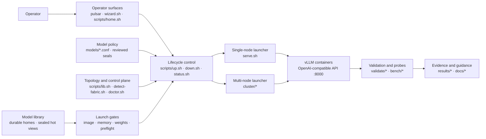

# Pulsar GB10 vLLM Stack

[](LICENSE)
[](docs/HARDWARE.md)
[](docs/BUILD.md)
[](docs/VALIDATION.md)

*Topology-aware vLLM operations for one or more NVIDIA DGX Spark systems:
every exact serving geometry must earn its status on GB10 hardware.*

Upstream-oriented control plane for Grace-Blackwell GB10 clusters. It
automatically discovers cluster membership and its node count, and can operate
any number of differently named confirmed nodes. Serving remains evidence-gated
by exact profiles: the
published matrix currently validates one- and two-node geometries, but that is
an evidence boundary, not a control-plane limit (each validated node has
121 GiB unified LPDDR5X and dual-rail 200GbE RoCE).
Built and validated 2026-07-27..31; every serving claim below traces to a
measured run in `docs/VALIDATION.md` with raw evidence in `results/`.

Priority order everywhere: **stability > accuracy > throughput > latency.**

## Pulsar subsystem map



The model library is the only weight-distribution mechanism
([ADR 0006](docs/decisions/0006-model-library-only-weight-distribution.md)):
one durable home per exact revision, sealed hot views on non-home ranks, and
local files on every rank before vLLM starts. There is no mode-selection
axis; `--weight-source`/`--weight-mode` fail closed. Live NFSv4.2/RDMA under
vLLM remains rejected as a serving runtime source (ADR 0005): a crashed rank
cannot cold-start without the owner export; leftover site mounts get
unmount/teardown only. Control SSH, inference NCCL/RoCE, and weight
transfer remain distinct data planes even when they involve the same machines.

## What sets this stack apart

1. **Multi-node is real, measured, and root-caused — not "wired but
   untested".** A 284B flagship serves TP=2 across the RoCE link at
   48 tok/s single-stream on the 0731 DSpark benches (27 base; no 20 GB
   tok/s re-run) with CUDA graphs on, soaked 150 min / 0 errors at 20 GB. The interconnect is characterized
   to physics (PCIe-x4-capped ~21 GB/s, 25 µs all-reduce floor), the
   official-image cross-node CUDA-graph hang that went unsolved for days in
   prior art is root-caused with its workaround, and node-loss semantics
   are documented (`/health` lies for ~5 minutes; recovery never happens —
   teardown and relaunch).
2. **Claim hygiene: statuses are earned, and wrong turns stay visible.**
   Every number traces to a run with raw artifacts in `results/`; verdicts
   are IDENTICAL / FP-EQUIVALENT / DIVERGENT, not adjectives. When our own
   benchmark harness turned out to under-meter speculative decoding by the
   acceptance factor (3.46x), the verdicts were re-earned and the full
   retraction trail kept in `docs/VALIDATION.md` — the ledger records how
   we were wrong, so the next reader can't repeat it.
3. **Correctness validated in depth, not just capability.** Equivalence vs
   HF transformers, a five-experiment determinism hierarchy (bit-exact
   same-boot; per-boot compile nondeterminism isolated; cross-node
   bit-identity via `VLLM_BATCH_INVARIANT=1`), quantization justified
   against a BF16 control, needle tests at every claimed context length,
   and 1-vs-2-node eval-score parity.
4. **Provenance that gets cheaper over time.** The overlay `Dockerfile` and
   sealed canary pin official-image **digests**; most mainline serving
   profiles still launch the mutable `v0.26.0` **tag**. The PR exception is
   published as a digest-pinned image built cleanly from a public PR head
   proposed for main — no private fork lineage. Upstream is
   already absorbing our delta (vllm #49731 merged the same draft-head
   optimization we carried as a patch, one day after we wrote it).
5. **Cluster operations as first-class deliverables.** Discovery verifies
   hostname-independent GB10 membership and every RoCE pair; preflight and
   teardown visit every node used by the selected profile. Pin-bump and on-call runbooks plus
   exact profile geometry and topology gates keep invented node counts out of
   the wizard, while validation labels remain visible and advisory.

## Quick start

**Run these on a DGX Spark (head node), not a laptop.**  
Stack needs Docker + NVIDIA Container Toolkit on GB10 (aarch64).
`scripts/model-library.sh home add` also needs `hf` or `huggingface-cli`
on PATH before it can download a Hugging Face repository into the model
library. Full host checklist:
[docs/PREREQUISITES.md](docs/PREREQUISITES.md).

### Single-node quick start — first token

```bash
git clone <this-repo> && cd pulsar-gb10-vllm-stack   # or your local path
docker pull vllm/vllm-openai:v0.26.0

# Host sanity (GPU, docker, port, cache)
scripts/doctor.sh

# Confirm topology identity once — serving requires a confirmed manifest,
# and a single machine is a valid one-node topology (ADR 0006).
scripts/detect-fabric.sh --write-topology

# List every serving profile with advisory release and legacy labels
scripts/list-models.sh --serving

# First serving model: acquire one durable home, prepare exact runtime
# views, then serve. Requires hf or huggingface-cli on PATH. An unsealed
# profile uses the source-attested two-step: inspect a read-only plan,
# then confirm the exact commit that plan reported.
scripts/model-library.sh home add nemotron-3-nano-30b-nvfp4 \
  --revision main --plan --json
scripts/model-library.sh home add nemotron-3-nano-30b-nvfp4 \
  --revision <exact-commit-from-plan> --yes
scripts/model-library.sh catalog refresh
scripts/model-library.sh prepare nemotron-3-nano-30b-nvfp4 --yes
./pulsar start nemotron-3-nano-30b-nvfp4            # → scripts/up.sh
# equivalent: scripts/up.sh nemotron-3-nano-30b-nvfp4
# The wizard (./pulsar wizard) guides topology confirmation, readiness, and
# preparation for every profile, plus acquisition for sealed profiles; the
# unsealed source-attested two-step above remains a manual CLI action.

# Operator home (neutral workflow menu — no doctor/preflight until you pick)
./pulsar
# Browse model storage; refresh/preparation is explicit and never starts serving
./pulsar models
# Direct serve/switch wizard (doctor + preflight; not the no-arg home)
./pulsar wizard
# equivalent: ./wizard.sh
# Note: "./ wizard.sh" (space after ./) → "-bash: ./: Is a directory"; use "./pulsar wizard"
# UI: vendored Gum on Linux ARM64 (blue palette). GUM=0 / NO_COLOR /
# PULSAR_COLOR=never / TERM=dumb → plain uncolored menus (Gum not used).
# PULSAR_ACCENT overrides blue accent when Gum is color-enabled (default 12)
# Non-interactive stdin/stderr automatically uses the EOF-safe plain path
```

**Operator home (`./pulsar`):** workflow menu — Current system status (default),
Serve or switch a model, Stop a serving model, Models & storage, Maintenance,
Diagnostics, Exit. Models & storage browses cached exact identity,
durable-home/runtime placement, and findings. Browsing and health rechecks
are read-only. A separate, confirmation-gated refresh can rescan confirmed
ranks and update only the cached catalog; it never runs automatically. A
second confirmed action can prepare a serving profile with reviewed identity
using eight-stream SSH-over-RoCE and no fallback. It verifies and budgets
rank-local views but does not start serving, qualify the model, or change
its release status. Retention, cleanup, repair, and durable-home removal
remain separate direct-CLI workflows.
Home is read-only by default; it does not run doctor/inventory until you choose.
Quick status is a focused overview (inventory + `/v1/models` advertisement only —
**not** an inference smoke). Full completion smoke is optional and explicit.
Stop/maintenance only offer inventory `safe_to_stop` stack-managed services and
always confirm before calling `scripts/down.sh` (never Docker cleanup directly).
No automatic stale cleanup on doctor or startup.

**Model switch safety (wizard):** `./pulsar wizard` still runs doctor once, then
reads `scripts/inventory.sh --json` and `scripts/check-memory.sh`. It only offers
stop for inventory `safe_to_stop` stack-managed services, never for unlabeled,
legacy, mismatch, unknown, incomplete, or unreachable nodes. Stops run only
after you confirm the final start/replace action; then inventory and cold
memory preflight re-run (memory reclaim is never assumed). Docker/SSH probe
errors fail closed and are never presented as missing artifacts; only
label-proven complete node placements receive the already-loaded memory exemption. Hard
memory FAIL never offers “continue anyway”; WARN may, with an explicit
confirmation.

For a one-node profile on a confirmed topology, the wizard now makes physical
placement explicit. It lists only identity-confirmed nodes whose Docker endpoint
is reachable and whose **cold-start** memory check does not hard-fail, shows
free memory and current Pulsar occupancy, and recommends an idle eligible node.
Every later artifact, port, ownership, launch, health, status, restart, and stop
step follows that immutable node ID. A service on other physical nodes is not a
blocker and is never scheduled for replacement.
See [docs/OPERATIONS.md](docs/OPERATIONS.md).

**Smoke** (lab network only — do **not** expose `:8000` without auth;
[SECURITY.md](SECURITY.md)):

```bash
# If VLLM_API_KEY is set, add: -H "Authorization: Bearer $VLLM_API_KEY"
curl -fsS http://127.0.0.1:8000/v1/models
curl -fsS http://127.0.0.1:8000/v1/completions \
  -H 'Content-Type: application/json' \
  -d '{"model":"nemotron-3-nano","prompt":"2+2=","max_tokens":4,"temperature":0}'
# conf id ≠ API id: nemotron-3-nano-30b-nvfp4 → served name nemotron-3-nano
# qwen3-1.7b → qwen3-1.7b
```

```bash
./pulsar status nemotron-3-nano-30b-nvfp4
./pulsar stop nemotron-3-nano-30b-nvfp4
# equivalent: scripts/status.sh / scripts/down.sh
./pulsar inventory                 # read-only service + memory inventory

# Explicit one-node placement (copy node_id from inventory --json):
./pulsar start qwen3-1.7b --node <node-id>
./pulsar status qwen3-1.7b --node <node-id>
./pulsar stop qwen3-1.7b --node <node-id>
```

Every serving profile is an exact Hugging Face `model_id@commit`; the
absolute-path catalog profiles were removed with the replicated path
(ADR 0006).

### Confirmed cluster — validated two-node flagship

Harder path: confirm the RoCE topology, then stage the published custom image
and weights on every node required by the exact profile. DeepSeek remains an
exact two-node profile; extra discovered capacity stays idle.

```bash
# Read-only discovery preview. Differently named hosts are supported.
scripts/detect-fabric.sh --json
# If mDNS is incomplete, add --candidate HOST repeatedly or set
# CLUSTER_CANDIDATES=atlas-a,atlas-b.

# Review and confirm exact membership; writes gitignored .cluster-topology.json.
scripts/detect-fabric.sh --write-topology

# Optional runtime/path/auth overrides only; topology is not stored in .env.
cp .env.example .env

# Pull/stage the qualified digest to every node used by the profile, then
# acquire one durable home and prepare sealed views on every serving rank.
scripts/sync-image.sh deepseek-v4-flash --pull --yes
scripts/topology-ssh-trust.sh enroll && scripts/topology-ssh-trust.sh check
scripts/model-library.sh home add deepseek-v4-flash --yes
scripts/model-library.sh catalog refresh
scripts/model-library.sh prepare deepseek-v4-flash \
  --backend copy --transport ssh-roce --copy-streams 8 --yes

scripts/doctor.sh
scripts/up.sh deepseek-v4-flash                  # exact NODES=2, DSpark k=5
# rollback: scripts/up.sh deepseek-v4-flash --no-spec-decode
# dry-run checks only: scripts/up.sh deepseek-v4-flash --dry-run

./pulsar status deepseek-v4-flash
./pulsar stop deepseek-v4-flash
```

The wizard offers every exact serving profile that fits confirmed capacity,
shows its status and profile notes, and orders legacy evidence-backed choices
first. Validation status never blocks serving. No three-node profile is
promoted today. Smoke served name:
`deepseek-v4-flash`; cold load can take ~10+ minutes.

`--legacy-tested` filters the historical `STATUS=tested*` recommendation class.
`--validated` was removed (ADR 0008); it fails closed and names `--legacy-tested`.
That filter is not a Model
Serving Release status filter under
[ADR 0004](docs/decisions/0004-model-serving-release-validation.md), and no
existing profile is automatically relabeled `Validated`. A **Model Serving
Release** is the immutable combination of exact model identity, exact serving
recipe, runtime/image identity, and supported hardware geometry; changing any
component creates a new release. The repository now has pure version-1
descriptor, contract, run-record, evidence-bundle, and reviewed-decision
validators. Read-only persistence and verification of stored ADR 0004 objects
is implemented under `models/model-serving-releases/`. That store holds the
reviewed Qwen3.8-27B-FP8 lineage; its advisory decision is
`Testing incomplete`. Local ADR 0004 evidence-capture candidate persistence
can record unreviewed run and bundle candidates without writing that registry
or launching a model. Advisory catalog/operator status projection is
implemented for an explicitly bound release; `qwen3.8-27b-fp8` is bound, and
other current profiles remain unbound and therefore display a neutral release
state. Maintainer-only issuance staging can propose registry objects; a
successful local command is not trusted until repository review and merge.
Serving is status-independent, while concrete identity, recipe, topology,
capacity, security, and lifecycle checks still fail closed. No schema object or selftest
establishes physical DGX behavior.

**Weight storage:** the model library is the only mechanism
([ADR 0006](docs/decisions/0006-model-library-only-weight-distribution.md)).
It keeps one durable home per exact revision, uses a symlink view on the
home rank, and transfers sealed hot copies only to other ranks. Its control
plane enforces reviewed exact commit/manifest seals where a profile carries
one, creates a rank-local witness after full verification, uses a metadata
fast path for unchanged launch, and visibly rehashes on drift before
launching the exact snapshot. Profiles without a reviewed seal launch with
`identity=legacy-unsealed` after full verification. The diagnostic
`qwen3-1.7b` profile carries the first reviewed lab seal and validation
bundle; the flagship `deepseek-v4-flash` profile carries the second and
passed its post-issuance physical enforcement, one-home lifecycle, and
2026-08-16 two-rank GA closure gates (587 requests, zero errors, 30 minutes;
a 1.14 GiB memory-shrink warning is retained for review). The exact DeepSeek
Model Serving Release failed strict same-boot determinism, so it cannot be
called `Validated`; that result does not invalidate the distribution
subsystem. One-rank library serving is supported by decision with its
physical serving-integration evidence still pending (ADR 0006 records the
accepted risk). Live NFS/RDMA serving is retired
([ADR 0005](docs/decisions/0005-reject-live-nfs-rdma-serving.md); history in
[docs/WEIGHT_FABRIC.md](docs/WEIGHT_FABRIC.md)); the canonical architecture
is [docs/MODEL_LIBRARY_DESIGN.md](docs/MODEL_LIBRARY_DESIGN.md). For an
existing eligible primary home, reviewed multi-rank preparation is
topology-bound SSH-over-RoCE with eight streams and no fallback. Enroll and
check SSH trust first, then use the exact preparation command:

```bash
scripts/topology-ssh-trust.sh enroll
scripts/topology-ssh-trust.sh check
scripts/model-library.sh catalog refresh
scripts/model-library.sh prepare <multi-rank-sealed-profile> --yes
```

Multi-rank `prepare` defaults to topology-bound eight-stream SSH-over-RoCE.
One-rank `prepare` uses `ssh-control` with one stream. Explicit
`--transport ssh-control` is the diagnostic override for management-network
bulk copy.

Catalog refresh inventories existing homes; it does not download a model or
create the required durable home. Acquisition is `home add`: it creates
exactly one durable home, which is then explicitly registered and prepared.
A sealed profile uses its reviewed identity:

```bash
scripts/model-library.sh home add <sealed-profile> --yes
scripts/model-library.sh catalog refresh
```

For a brand-new unsealed profile, first inspect a read-only source-attested
plan, then separately confirm the exact commit shown by that plan:

```bash
scripts/model-library.sh home add <profile> \
  --revision <selector> --plan --json
scripts/model-library.sh home add <profile> \
  --revision <exact-commit-from-plan> \
  --node <selected-rank-from-plan> --yes --json
scripts/model-library.sh catalog refresh
scripts/model-library.sh home verify <model_id@exact-commit> --json
```

The selected target rank downloads and full-verifies the exact commit. The
unsealed path binds complete upstream inventory and observed bytes in an
immutable site-local receipt; acquisition creates source/catalog evidence, not
a reviewed seal or validation decision. Neither path creates hot copies,
starts serving, or promotes the path. A reviewed
single-rank profile has no non-home target and therefore uses no RoCE copy;
prepare that local runtime view with `--transport ssh-control` instead. See
[ADR 0003](docs/decisions/0003-explicit-model-preparation-transport.md) and
[ADR 0004](docs/decisions/0004-model-serving-release-validation.md).
Maintainers can
assemble deterministic unreviewed identity candidates through the separate
[model release runbook](docs/MODEL_RELEASE.md); that tool cannot issue or
promote a claim and is not exposed through `pulsar`.

### What the tools do

| Command | Role |
|---|---|
| `./pulsar` | Root dispatcher → operator home |
| `./pulsar wizard` | Guided serve/switch wizard |
| `./pulsar models` | Cached distributed model identity, placement, findings, and explicit catalog refresh |
| `./pulsar inventory` | Read-only managed service + memory inventory |
| `./pulsar doctor [--json]` | Read-only host, cluster, and model-library diagnostics |
| `./pulsar start` / `stop` / `status` | Route to `up.sh` / `down.sh` / `status.sh` |
| `scripts/model-library.sh health [--json]` | Sanitized cached-catalog and rank-local hot metadata health |
| `scripts/list-models.sh` | Conf catalog |
| `scripts/check-weights.sh` | Prepared library views on every exact rank |
| `scripts/model-library.sh` | Durable homes, acquisition, preparation, retention |
| `./pulsar weight-fabric` | Leftover live-NFS show/unmount/teardown only (ADR 0005) |
| `scripts/check-image.sh` / `sync-image.sh` | Image presence / stage every exact rank |
| `scripts/check-memory.sh` | MemAvailable vs weights+KV+OS buffer |
| `scripts/detect-fabric.sh` | Discover, verify, and confirm N-node topology |
| `scripts/up.sh` / `down.sh` / `status.sh` | Start (with gates) / stop / probe (canonical) |
| `./wizard.sh` | Direct wizard entry (same as `./pulsar wizard`) |
| `./serve.sh` / `cluster/*` | Low-level launchers (still supported) |

All servers speak the OpenAI API on :8000. Per-model flags live in
`models/<name>.conf`. Current ship matrix: top of
[docs/VALIDATION.md](docs/VALIDATION.md).

## Images: what runs, and what was patched

| Image | What it is | Serves |
|---|---|---|
| `vllm/vllm-openai:v0.26.0` (runtime **tag**; digest pinned in `Dockerfile` and `qwen3-1.7b`) | Official multi-arch release — first arm64/CUDA-13 tag with native sm_121 kernels (12.0f family). No source build needed for these models (`docs/BUILD.md` has the decision record). | Qwen, Nemotron, Laguna, and small canaries |
| `ghcr.io/luisefigueroa/pulsar-gb10-vllm-stack:pr41834-d64074e6f` | **Published arm64 source build of vLLM PR #41834 HEAD** (see below); immutable digest is pinned in model confs | DeepSeek-V4-Flash flagship and Inkling-Small-NVFP4 |

### The PR #41834 image (the only "patch" in the stack)

Stock release images **cannot** serve DeepSeek-V4 on GB10 — the
`FLASHINFER_MLA_SPARSE_SM120` attention kernel livelocks under prefill load
(upstream vllm#49026; reproduced here, probe series in VALIDATION.md). The
fix is not merged upstream, so the published flagship image is built from the
**head of vLLM PR #41834** ("DeepSeek-V4-Flash on SM12x", pinned at commit
`d64074e6f`) — built as the PR tree, not cherry-picked, because it is the
community-validated lineage (188 commits) and includes:

- working DSA/sparse-MLA attention for sm_121 (Triton path)
- the long-context cooperative top-k shared-memory fix (`topk.cu`)
- a fused DeepSeek-V4 qnorm+rope+KV-insert kernel
- **GB10-specific tuned MoE/GEMM configs** (`device_name=NVIDIA_GB10` JSONs)
- DSpark drafter rejection-sampling fixes

Build provenance: `torch_cuda_arch_list='12.0'` (12.0f family = native sm_121 under
CUDA 13.0.3), 1 h 40 min on the 20-core Grace. Full recipe in
`docs/BUILD.md`. When PR #41834 merges upstream this collapses to a stock
pin bump + revalidation.

The published container includes CUDA and other components under their own
terms; it is not licensed solely under this repository's Apache-2.0 license.
See [docs/IMAGE-LICENSES.md](docs/IMAGE-LICENSES.md).

## Optimizations applied (all measured on THIS cluster)

- **NCCL**: dual-rail RoCE (`NCCL_IB_HCA=rocep1s0f0,roceP2p1s0f0`, +47%
  large-message bandwidth) + `NCCL_IB_QPS_PER_CONNECTION=4` (+9% at ≥256 MB),
  bootstrap pinned off the mgmt NIC. MTU stays 1500 — jumbo measured ≤+1.5%
  (PCIe Gen5 x4 is the real ceiling, ~21 GB/s).
- **CUDA graphs ON everywhere they are stable** (worth ~2x at low
  concurrency); the one exception is cross-node TP=2 on the *official*
  image, which requires `--enforce-eager` (root-caused graph-path hang).
- **`--moe-backend marlin` for all NVFP4 MoE** — CUTLASS FP4 MoE silently
  produces wrong output on sm_121.
- **FP8 checkpoints justified by control**: Qwen3.6-27B FP8 vs BF16 gsm8k
  0.615 vs 0.610 — quantization is free here.
- **Speculative decoding — verdicts CORRECTED 2026-07-31** after we caught
  our own harness under-metering it (SSE chunk counting divided spec
  throughput by the accepted-block size; full story in TROUBLESHOOTING +
  the VALIDATION retraction trail). With honest metering and natural
  prompts: DSpark on the flagship **+79%** (48.4 vs 27.1 tok/s c=1),
  Nemotron-Super MTP **+47%**, Laguna DFlash +13% (marginal). Optional paths
  use `--spec-decode`; the flagship's soak-proven DSpark path is default-on
  and rolls back with `--no-spec-decode`. Its k=5 equals the checkpoint's
  `dspark_block_size` and is not a tuning knob. The spec-enabled 150-min soak
  has PASSED twice. The one standing failure:
  ngram on GDN hybrids **corrupts output** — never enable it there.
- **Deliberately OFF / not load-bearing, by measurement** (not vibes):
  MTU 9000, Ray (native `--nnodes` mp is the validated multi-node path).
  `VLLM_MARLIN_USE_ATOMIC_ADD` is **not** a cluster-wide switch — Nano/Super
  confs set it; Laguna leaves it unset (see `docs/TUNING.md`).

## Models tested

| Config | c=1 tok/s (% of roofline) | Aggregate | gsm8k strict | Needle | Soak |
|---|---|---|---|---|---|
| **deepseek-v4-flash** (2-node TP=2, PR-41834; **0731, DSpark, 20 GB/rank KV → 652k**) | **27.15** base (68%) / **43–48** DSpark (**0731 benches**; no 20 GB tok/s re-run) | 104 @ c=8 (0731) | 0.935 (0731 battery; 20 GB gsm8k not re-run) | 3/3 @ **447K** (`results/needle-dsv4-20gb-447k.log`) | **150 min @ c=5, 3201 req, 0 err** (20 GB canonical) |
| laguna-s-2.1-nvfp4 (historical; profile removed by ADR 0006) | 19.5 (79%) | 66 @ c=4 | 0.820 | 3/3 @ 261K (ledger; no `results/` needle file) | 150 min, 1873 req, 0 err |
| nemotron-3-super-120b-nvfp4 | 16.2 (85%) | 113 @ c=32 | 0.940 | — | 20 min clean |
| nemotron-3-nano-30b-nvfp4 | 61.9 (86%) | 399 @ c=16 | 0.830 | 3/3 @ 124K (ledger; no `results/` needle file) | 15 min clean |
| qwen3.6-27b-fp8 (GDN hybrid, 1-node only) | 8.0 (94%) | 93 @ c=16 | 0.615 | 3/3 @ 121K (ledger; no `results/` needle file) | 20 min clean |

Roofline = 240 GB/s measured bandwidth / active-bytes-per-token; it predicts
within 6–21% for every model. The big catalog models (V4-Pro 865 GB,
Kimi-k3 1.5 TB, GLM-5.2 1.5 TB, Inkling 1.9 TB…) **do not fit two nodes** —
arithmetic in `docs/MODELS.md`.

## Validation summary

Full ledger: `docs/VALIDATION.md`. Gates passed: correctness vs HF
transformers (FP-equivalent), quantization control (FP8=BF16), determinism
(bit-exact same-boot; cross-node bit-identity via `VLLM_BATCH_INVARIANT=1`
for standard-attention models; per-boot compile nondeterminism root-caused),
1-vs-2-node parity (gsm8k 0.820 vs 0.825), long context by needle at each
claimed length, node-loss behavior characterized, and soaks (zero errors,
no leaks, no thermal throttling anywhere).

**Failures found and documented, not papered over:**
- Cross-node TP=2 + CUDA graphs hangs on official images (resolves the
  prior repo's multi-day unsolved bug; `--enforce-eager` is the workaround).
- GDN hybrids (e.g. Qwen3.6-27B) break three ways: cross-node TP (wrong
  output then hang), ngram spec decode (corrupted output), batch-invariant
  mode (refuses to start). Single-node plain serving is perfect.
- DeepSeek-V4 on stock images: kernel livelock under prefill pressure.
- `/health` lies for ~5 min after a node loss — monitor 2-node deployments
  with a real 1-token completion, never the health endpoint alone.
- lm-eval client-side tokenization + broken tokenizer regex = falsely
  catastrophic scores (`tokenized_requests=False` fixes).

## Upstream tracking

- **vllm PR #41834** — flagship image lineage; our pin IS the current PR
  head. On merge: retire the published PR image for a stock pin, rerun the gates.
- **vllm #49026 / #46253** — the two stock-image blockers we reproduced.
- **Bump trigger: v0.26.1-final with arm64 images** (rc0 tagged upstream).
  It bumps NCCL 2.28→2.30.7 — full REVALIDATE including fresh Step-0 NCCL
  numbers. Note vllm #49731 (merged to main) makes
  `patches/pr41834-dspark-opt/` redundant on the next flagship rebuild.
- Closed chapter: the fork's draft-path optimizations were ported and
  measured **perf-neutral** — the fork's apparent spec-decode advantage was
  our own metering bug, not missing code (VALIDATION retraction trail).

## Layout

| Path | What |
|---|---|
| `models/*.conf` | exact legacy serving profiles; `STATUS` values are earned by runs and are not ADR 0004 release decisions |
| `models/seals/` | reviewed exact model seal contracts, including the issued `qwen3-1.7b` lab identity |
| `models/validation-bundles/` | legacy schema-1 combined model/runtime/image/geometry/evidence claims; not a Model Serving Release ID and unchanged by the pre-issuance ADR 0004 schema correction |
| `models/model-serving-releases/` | tracked ADR 0004 release/contract/run/bundle/decision registry; holds the reviewed Qwen3.8 lineage (`Testing incomplete`); read-only through `scripts/model-serving-release-registry.sh` |
| `scripts/model-serving-release-capture.sh` | local ADR 0004 evidence-capture candidate persistence; unreviewed, launches nothing, never writes the tracked registry |
| `scripts/model_identity.py`, `scripts/model-release.sh` | shared trust schemas plus maintainer-only unreviewed release-candidate assembly; not part of normal `pulsar` UX |
| `cluster/` | Exact N-rank launch/preflight/teardown + confirmed topology loader |
| `validate/` | capture/compare (IDENTICAL / FP-EQUIVALENT / DIVERGENT verdicts), needle, bench, post-boot `warmup.py`, soak |
| `results/` | raw evidence for every number (`results/README.md` is the map) |
| `bench/` | Step 0 microbenchmarks (membw, NCCL sweeps) |
| `patches/pr41834-dspark-opt/` | **DEPRECATED** DSpark draft-path A/B (perf-neutral; obsolete after vllm #49731). Not on default build path — see that dir’s README |
| `docs/` | **PREREQUISITES** (bootstrap gate), HARDWARE, MODELS, **MODEL_LIBRARY_DESIGN** (canonical storage/identity/qualification doctrine), **MODEL_RELEASE** (maintainer candidate workflow), **MODEL_SERVING_RELEASE_CAPTURE** (ADR 0004 evidence-capture candidates), **decisions/** (accepted rationale, including ADR 0004's Model Serving Release policy), RECIPES, MULTINODE, BUILD, TUNING, VALIDATION, REVALIDATE, OPERATIONS, TROUBLESHOOTING |
| `LICENSE` / `SECURITY.md` | Apache-2.0; deployment security notes |

Confirm site-local membership with `scripts/detect-fabric.sh --write-topology`.
The resulting `.cluster-topology.json` is gitignored; do not commit site
addresses. `HEAD_IP` / `WORKER_IP` environment variables never confirm
membership and do not construct topology; multi-node operations require the
confirmed manifest.

## License

Copyright 2026 Luis Figueroa. Licensed under the [Apache License 2.0](LICENSE).
