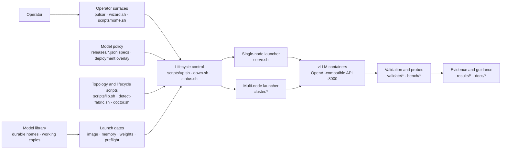

# Pulsar GB10 vLLM Stack

[](LICENSE)
[](docs/HARDWARE.md)
[](docs/BUILD.md)
[](docs/VALIDATION.md)

*Topology-aware vLLM operations for one or more NVIDIA DGX Spark systems:
every exact serving geometry must earn its status on GB10 hardware.*

Lifecycle scripts for Grace-Blackwell GB10 clusters. They
automatically discover cluster membership and its node count, and can operate
any number of differently named confirmed nodes. Serving remains evidence-gated
by exact profiles: the
published matrix currently covers one- and two-node geometries, but that is
an evidence boundary, not a script limit (each measured node has
121 GiB unified LPDDR5X and dual-rail 200GbE RoCE).
Built and validated 2026-07-27..31; every serving claim below traces to a
measured run in `docs/VALIDATION.md` with raw evidence in `results/`.

Priority order everywhere: **stability > accuracy > throughput > latency.**

## Pulsar subsystem map



The model library is the only weight-distribution mechanism
([ADR 0006](docs/decisions/0006-model-library-only-weight-distribution.md)):
one durable home per exact revision, working copies on other serving ranks, and
local files on every rank before vLLM starts. There is no mode-selection
axis; `--weight-source`/`--weight-mode` fail without fallback. Live NFSv4.2/RDMA under
vLLM remains rejected as a serving runtime source (ADR 0005): a crashed rank
cannot cold-start without the NFS export; leftover site mounts get
unmount/teardown only. Control SSH, inference NCCL/RoCE, and the copy path
used at prepare remain distinct data planes even when they involve the same machines.

## What sets this stack apart

1. **Multi-node behavior is explicit and geometry-bound.** Confirmed
   topology, separate control and data planes, lifecycle ownership, rank-local
   files, and no-fallback preparation are enforced. Every exact model, image,
   recipe, and geometry still needs its own qualification.
2. **Claim hygiene: statuses are earned, and wrong turns stay visible.**
   Every number traces to a run with raw artifacts in `results/`; verdicts
   are IDENTICAL / FP-EQUIVALENT / DIVERGENT, not adjectives. When our own
   benchmark harness turned out to under-meter speculative decoding by the
   acceptance factor (3.46x), the verdicts were re-earned and the full
   retraction trail kept in `docs/VALIDATION.md` — the ledger records how
   we were wrong, so the next reader can't repeat it.
3. **Correctness validated in depth, not just capability.** Equivalence vs
   HF transformers, a five-experiment determinism hierarchy (bit-exact
   same-boot; per-boot compile nondeterminism isolated; cross-node
   bit-identity via `VLLM_BATCH_INVARIANT=1`), quantization justified
   against a BF16 control, needle tests at every claimed context length,
   and 1-vs-2-node eval-score parity.
4. **Provenance that gets cheaper over time.** The overlay `Dockerfile` and
   digest-pinned canaries use official-image **digests**; most mainline serving
   profiles still launch the mutable `v0.26.0` **tag**. The PR exception is
   published as a digest-pinned image built cleanly from a public PR head
   proposed for main — no private fork lineage. Upstream is
   already absorbing our delta (vllm #49731 merged the same draft-head
   optimization we carried as a patch, one day after we wrote it).
5. **Cluster operations as first-class deliverables.** Discovery verifies
   hostname-independent GB10 membership and every RoCE pair; preflight and
   teardown visit every node used by the selected profile. Pin-bump and on-call runbooks plus
   exact profile geometry and topology gates keep invented node counts out of
   the wizard, while validation labels remain visible and do not grant or deny start.

## Quick start

**Run these on a DGX Spark (head node), not a laptop.**  
Stack needs Docker + NVIDIA Container Toolkit on GB10 (aarch64).
`scripts/model-library.sh home add --revision` needs the modern `hf` CLI on
the selected rank (either on `PATH` or at Pulsar's managed
`$HOME/.hf-cli/venv/bin/hf` path). Older Hugging Face CLI commands are not
sufficient because acquisition resolves the complete upstream Git/LFS file
list through the modern CLI's Python environment. Full host checklist:
[docs/PREREQUISITES.md](docs/PREREQUISITES.md).

### Single-node quick start — first token

```bash
git clone <this-repo> && cd pulsar-gb10-vllm-stack   # or your local path
docker pull vllm/vllm-openai:v0.26.0

# Host sanity (GPU, docker, port, cache)
scripts/doctor.sh

# Confirm topology identity once — serving requires a confirmed manifest,
# and a single machine is a valid one-node topology (ADR 0006).
scripts/detect-fabric.sh --write-topology

# A profile is a released spec id (ADR 0017): list them with the display-only
# spec review the catalog shows (start does not use that review as permission)
scripts/release.sh list
scripts/list-models.sh --serving

# First serving model: acquire one durable home for the spec's exact model,
# prepare exact runtime views, then serve. Requires modern hf on the selected
# rank. Inspect a read-only Hugging Face plan (recorded file list), then
# confirm the exact commit and rank that plan reported.
scripts/model-library.sh home add <spec_id> \
  --revision main --plan --json
scripts/model-library.sh home add <spec_id> \
  --revision <exact-commit-from-plan> \
  --node <selected-rank-from-plan> --yes
scripts/model-library.sh catalog refresh
scripts/model-library.sh prepare <spec_id> --yes
./pulsar start <spec_id>                           # → scripts/up.sh
# equivalent: scripts/up.sh <spec_id>
# The wizard (./pulsar wizard) guides topology confirmation, readiness, and
# preparation. Hugging Face download with --revision remains a manual CLI
# action (not wizard home add).

# Workflow menu (no doctor/preflight until you pick)
./pulsar
# Browse model storage; refresh/preparation is explicit and never starts serving
./pulsar models
# Direct serve/switch wizard (doctor + preflight; not the no-arg menu)
./pulsar wizard
# equivalent: ./wizard.sh
# Note: "./ wizard.sh" (space after ./) → "-bash: ./: Is a directory"; use "./pulsar wizard"
# UI: vendored Gum on Linux ARM64 (blue palette). GUM=0 / NO_COLOR /
# PULSAR_COLOR=never / TERM=dumb → plain uncolored menus (Gum not used).
# PULSAR_ACCENT overrides blue accent when Gum is color-enabled (default 12)
# Non-interactive stdin/stderr automatically uses the EOF-safe plain path
```

**Workflow menu (`./pulsar`):** Current system status (default),
Serve or switch a model, Stop a serving model, Models & storage, Maintenance,
Configuration, Diagnostics, Exit. If cold recovery storage has no persisted
choice, first-use offers configure, disable, or not now before the main menu.
Configuration → Cold recovery storage delegates to
`./pulsar configure cold-storage`. Models & storage browses cached exact identity,
durable-home/runtime placement, and findings. Browsing and health rechecks
are read-only. A separate, confirmation-gated refresh can rescan confirmed
ranks and update only the cached catalog; it never runs automatically. A
second confirmed action can prepare a serving profile with reviewed identity
using eight-stream SSH-over-RoCE and no fallback. It verifies and budgets
rank-local views but does not start serving, qualify the model, or change
its Model Serving Release status. Retention, cleanup, repair, and durable-home removal
remain separate direct-CLI workflows.
The menu is read-only by default; it does not run doctor/inventory until you choose.
Quick status is a focused overview (inventory + `/v1/models` advertisement only —
**not** an inference smoke). Full completion smoke is optional and explicit.
Stop/maintenance only offer inventory `safe_to_stop` stack-managed services and
always confirm before calling `scripts/down.sh` (never Docker cleanup directly).
No automatic stale cleanup on doctor or startup.

**Model switch safety (wizard):** `./pulsar wizard` still runs doctor once, then
reads `scripts/inventory.sh --json` and `scripts/check-memory.sh`. It only offers
stop for inventory `safe_to_stop` stack-managed services, never for unlabeled,
legacy, mismatch, unknown, incomplete, or unreachable nodes. Stops run only
after you confirm the final start/replace action; then inventory and cold
memory preflight re-run (memory reclaim is never assumed). Docker/SSH probe
errors fail without fallback and are never presented as missing artifacts; only
label-proven complete node placements receive the already-loaded memory exemption. Hard
memory FAIL never offers “continue anyway”; WARN may, with an explicit
confirmation.

For a one-node profile on a confirmed topology, the wizard now makes physical
placement explicit. It lists only identity-confirmed nodes whose Docker endpoint
is reachable and whose **cold-start** memory check does not hard-fail, shows
free memory and current Pulsar occupancy, and recommends an idle eligible node.
Every later artifact, port, ownership, launch, health, status, restart, and stop
step follows that immutable node ID. A service on other physical nodes is not a
blocker and is never scheduled for replacement.
See [docs/OPERATIONS.md](docs/OPERATIONS.md).

**Smoke** (lab network only — do **not** expose `:8000` without auth;
[SECURITY.md](SECURITY.md)):

```bash
# If VLLM_API_KEY is set, add: -H "Authorization: Bearer $VLLM_API_KEY"
curl -fsS http://127.0.0.1:8000/v1/models
curl -fsS http://127.0.0.1:8000/v1/completions \
  -H 'Content-Type: application/json' \
  -d '{"model":"nemotron-3-nano","prompt":"2+2=","max_tokens":4,"temperature":0}'
# spec id ≠ API id: the served name comes from the optional, gitignored
# .pulsar-overlay.json (port, served name, placement); without it the
# defaults apply: port 8000, served name = model id.
```

```bash
./pulsar status <spec_id>
./pulsar stop <spec_id>
# equivalent: scripts/status.sh / scripts/down.sh
./pulsar inventory                 # read-only service + memory inventory

# Explicit one-node placement (copy node_id from inventory --json):
./pulsar start <spec_id> --node <node-id>
./pulsar status <spec_id> --node <node-id>
./pulsar stop <spec_id> --node <node-id>
```

Every serving profile is an exact Hugging Face `model_id@commit`; the
absolute-path catalog profiles were removed with the replicated path
(ADR 0006).

### Confirmed cluster — two-node

Harder path: confirm the RoCE topology, then stage the image and weights on
every node required by the exact profile. Extra discovered capacity stays
idle. The example below uses an untested recipe shell and does not imply that
the model has passed onboarding or qualification.

```bash
# Read-only discovery preview. Differently named hosts are supported.
scripts/detect-fabric.sh --json
# If mDNS is incomplete, add --candidate HOST repeatedly or set
# CLUSTER_CANDIDATES=atlas-a,atlas-b.

# Review and confirm exact membership; writes gitignored .cluster-topology.json.
scripts/detect-fabric.sh --write-topology

# Optional runtime/path/auth overrides only; topology is not stored in .env.
cp .env.example .env

# Pull/stage the digest to every node used by a two-node spec, then acquire
# one durable home (Hugging Face plan, then exact commit) and prepare working
# copies on every serving rank. No two-node spec is released today; the
# commands below apply once one is.
scripts/sync-image.sh <spec_id> --pull --yes
scripts/topology-ssh-trust.sh enroll && scripts/topology-ssh-trust.sh check
scripts/model-library.sh home add <spec_id> \
  --revision main --plan --json
scripts/model-library.sh home add <spec_id> \
  --revision <exact-commit-from-plan> --yes
scripts/model-library.sh catalog refresh
scripts/model-library.sh prepare <spec_id> \
  --backend copy --transport ssh-roce --copy-streams 8 --yes

scripts/doctor.sh
scripts/up.sh <spec_id>
# dry-run checks only: scripts/up.sh <spec_id> --dry-run

./pulsar status <spec_id>
./pulsar stop <spec_id>
```

The wizard offers every released spec that fits confirmed capacity, shows
its display-only spec review, and orders reviewed `stable`/`validated` specs
first. Validation status never blocks serving. There is no separate
launch-trust-mode to choose
([ADR 0009](docs/decisions/0009-no-launch-trust-mode-axis.md)). No three-node profile is
promoted today.

The legacy profile `STATUS` label and its `--legacy-tested` filter are gone
with the conf profiles (ADR 0017 Stage 4); `--validated` was removed earlier
(ADR 0008) and fails without fallback. Spec review is not a Model
Serving Release status filter under
[ADR 0004](docs/decisions/0004-model-serving-release-validation.md), and no
existing profile is automatically relabeled `Validated`. A **Model Serving
Release** is the immutable combination of exact model identity, exact serving
recipe, runtime/image identity, and supported hardware geometry; changing any
component creates a new release. The repository now has Model Serving Release
descriptor, Validation Contract, run-record, evidence-bundle, and
reviewed-decision validators. Read-only persistence and verification of stored ADR 0004 objects
is implemented under `models/model-serving-releases/`. That store is empty.
Local ADR 0004 evidence-capture drafts
can record run and evidence-bundle JSON that is not in the trusted registry
and do not start a model. The catalog shows a reviewed status for a profile
that sets `MODEL_SERVING_RELEASE_ID`; no current profile sets that field.
Maintainer-only staging can propose registry objects; a
successful local command is not trusted until repository review and merge.
Serving is status-independent, while concrete identity, recipe, topology,
capacity, security, and lifecycle checks still fail without fallback. No schema object or selftest
establishes physical DGX behavior.

**Weight storage:** the model library is the only mechanism
([ADR 0006](docs/decisions/0006-model-library-only-weight-distribution.md)).
It keeps one durable home per exact revision, uses a symlink view on the
home rank, and copies working trees only to other ranks. Lifecycle scripts
create a rank-local witness after full verification, use a metadata
fast path for unchanged launch, and visibly rehash on drift before
launching the exact snapshot. Live file identity is the receipt plus occupancy
path (`identity_status=legacy-unsealed` after full verification). Lab
expected-identity files are not a live product (ADR 0012), and their
model-specific history is not retained in this reset. One-rank library serving is supported by decision with its
physical serving-integration evidence still pending (ADR 0006 records the
accepted risk). Live NFS/RDMA serving is retired
([ADR 0005](docs/decisions/0005-reject-live-nfs-rdma-serving.md); history in
[docs/WEIGHT_FABRIC.md](docs/WEIGHT_FABRIC.md)); the canonical architecture
is [docs/MODEL_LIBRARY_DESIGN.md](docs/MODEL_LIBRARY_DESIGN.md). For an
existing eligible primary home, multi-rank preparation is
topology-bound SSH-over-RoCE with eight streams and no fallback. Enroll and
check SSH trust first, then use the exact preparation command:

```bash
scripts/topology-ssh-trust.sh enroll
scripts/topology-ssh-trust.sh check
scripts/model-library.sh catalog refresh
scripts/model-library.sh prepare <multi-rank-profile> --yes
```

Multi-rank `prepare` defaults to topology-bound eight-stream SSH-over-RoCE.
One-rank `prepare` uses `ssh-control` with one stream. Explicit
`--transport ssh-control` is the diagnostic override for management-network
bulk copy.

Catalog refresh inventories existing homes; it does not download a model or
create the required durable home. Acquisition is `home add`: it creates
exactly one durable home, which is then explicitly registered and prepared.
For a brand-new profile, first inspect a read-only Hugging Face plan
(recorded file list), then separately confirm the exact commit shown by that plan:

```bash
scripts/model-library.sh home add <profile> \
  --revision <selector> --plan --json
scripts/model-library.sh home add <profile> \
  --revision <exact-commit-from-plan> \
  --node <selected-rank-from-plan> --yes --json
scripts/model-library.sh catalog refresh
scripts/model-library.sh home verify <model_id@exact-commit> --json
```

The selected target rank downloads and full-verifies the exact commit. That
path records complete upstream inventory and observed bytes in an
immutable site-local receipt; acquisition creates source/catalog evidence, not
a lab expected-identity file or a Model Serving Release decision. It does not
create working copies, start serving, or promote the path. A
single-rank profile has no non-home target and therefore uses no RoCE copy;
prepare that local runtime view with `--transport ssh-control` instead. See
[ADR 0003](docs/decisions/0003-explicit-model-preparation-transport.md) and
[ADR 0004](docs/decisions/0004-model-serving-release-validation.md).
Maintainers can
assemble draft Model Serving Release JSON through the separate
[Model Serving Release runbook](docs/MODEL_RELEASE.md); that tool cannot make
objects trusted or promote a claim and is not exposed through `pulsar`.

### What the tools do

| Command | Role |
|---|---|
| `./pulsar` | Root dispatcher → workflow menu |
| `./pulsar wizard` | Guided serve/switch wizard |
| `./pulsar models` | Cached distributed model identity, placement, findings, and explicit catalog refresh |
| `./pulsar inventory` | Read-only managed service + memory inventory |
| `./pulsar doctor [--json]` | Read-only host, cluster, and model-library diagnostics |
| `./pulsar configure cold-storage` | Explicit cold recovery storage configuration |
| `./pulsar start` / `stop` / `status` | Route to `up.sh` / `down.sh` / `status.sh` |
| `scripts/model-library.sh health [--json]` | Sanitized cached-catalog and rank-local hot metadata health |
| `scripts/list-models.sh` | Conf catalog |
| `scripts/check-weights.sh` | Prepared library views on every exact rank |
| `scripts/model-library.sh` | Durable homes, acquisition, preparation, retention |
| `scripts/check-image.sh` / `sync-image.sh` | Image presence / stage every exact rank |
| `scripts/check-memory.sh` | MemAvailable vs weights+KV+OS buffer |
| `scripts/detect-fabric.sh` | Discover, verify, and confirm N-node topology |
| `scripts/up.sh` / `down.sh` / `status.sh` | Start (with gates) / stop / probe (canonical) |
| `./wizard.sh` | Direct wizard entry (same as `./pulsar wizard`) |
| `./serve.sh` / `cluster/*` | Low-level launchers (still supported) |

All servers speak the OpenAI API on :8000. Per-model flags live in the
released spec (`releases/<spec_id>.json`; `scripts/release.sh show <spec_id>`).
Current ship matrix: [docs/MODELS.md](docs/MODELS.md); evidence ledger:
[docs/VALIDATION.md](docs/VALIDATION.md).

## Images: what runs, and what was patched

| Image | What it is | Serves |
|---|---|---|
| `vllm/vllm-openai:v0.26.0` (runtime **tag**; profiles carry immutable digest pins) | Official multi-arch release with native sm_121 kernels (12.0f family). See `docs/BUILD.md` before changing image pins. | Current v0.26.0 Qwen and Nemotron profiles |

The published container includes CUDA and other components under their own
terms; it is not licensed solely under this repository's Apache-2.0 license.
See [docs/IMAGE-LICENSES.md](docs/IMAGE-LICENSES.md).

## Optimizations applied (all measured on THIS cluster)

- **NCCL**: dual-rail RoCE (`NCCL_IB_HCA=rocep1s0f0,roceP2p1s0f0`, +47%
  large-message bandwidth) + `NCCL_IB_QPS_PER_CONNECTION=4` (+9% at ≥256 MB),
  bootstrap pinned off the mgmt NIC. MTU stays 1500 — jumbo measured ≤+1.5%
  (PCIe Gen5 x4 is the real ceiling, ~21 GB/s).
- **CUDA graphs ON everywhere they are stable** (worth ~2x at low
  concurrency); the one exception is cross-node TP=2 on the *official*
  image, which requires `--enforce-eager` (root-caused graph-path hang).
- **`--moe-backend marlin` for all NVFP4 MoE** — CUTLASS FP4 MoE silently
  produces wrong output on sm_121.
- **FP8 checkpoints justified by control**: Qwen3.6-27B FP8 vs BF16 gsm8k
  0.615 vs 0.610 — quantization is free here.
- **Speculative decoding uses corrected token accounting.** With natural
  prompts, Nemotron-Super MTP measured +47% and Laguna DFlash +13% (marginal).
  Optional paths use `--spec-decode`. The standing failure is:
  ngram on GDN hybrids **corrupts output** — never enable it there.
- **Deliberately OFF / not load-bearing, by measurement** (not vibes):
  MTU 9000, Ray (native `--nnodes` mp is the validated multi-node path).
  `VLLM_MARLIN_USE_ATOMIC_ADD` is **not** a cluster-wide switch — Nano/Super
  confs set it; Laguna leaves it unset (see `docs/TUNING.md`).

## Models tested (retired conf profiles; history)

Released specs and their reviews are in [docs/MODELS.md](docs/MODELS.md). The
rows below were measured under conf profiles that Stage 4 retired; they are
history, not a serving claim for any spec.

| Retired profile | c=1 tok/s (% of roofline) | Aggregate | gsm8k strict | Needle | Soak |
|---|---|---|---|---|---|
| laguna-s-2.1-nvfp4 (historical; profile removed by ADR 0006) | 19.5 (79%) | 66 @ c=4 | 0.820 | 3/3 @ 261K (ledger; no `results/` needle file) | 150 min, 1873 req, 0 err |
| nemotron-3-super-120b-nvfp4 | 16.2 (85%) | 113 @ c=32 | 0.940 | — | 20 min clean |
| nemotron-3-nano-30b-nvfp4 | 61.9 (86%) | 399 @ c=16 | 0.830 | 3/3 @ 124K (ledger; no `results/` needle file) | 15 min clean |
| qwen3.6-27b-fp8 (GDN hybrid, 1-node only) | 8.0 (94%) | 93 @ c=16 | 0.615 | 3/3 @ 121K (ledger; no `results/` needle file) | 20 min clean |

Roofline = 240 GB/s measured bandwidth / active-bytes-per-token; it predicts
within 6–21% for every model. The big catalog models (V4-Pro 865 GB,
Kimi-k3 1.5 TB, GLM-5.2 1.5 TB, Inkling 1.9 TB…) **do not fit two nodes** —
arithmetic in `docs/MODELS.md`.

## Validation summary

Full ledger: `docs/VALIDATION.md`. Gates passed: correctness vs HF
transformers (FP-equivalent), quantization control (FP8=BF16), determinism
(bit-exact same-boot; cross-node bit-identity via `VLLM_BATCH_INVARIANT=1`
for standard-attention models; per-boot compile nondeterminism root-caused),
1-vs-2-node parity (gsm8k 0.820 vs 0.825), long context by needle at each
claimed length, node-loss behavior characterized, and soaks (zero errors,
no leaks, no thermal throttling anywhere).

**Failures found and documented, not papered over:**
- Cross-node TP=2 + CUDA graphs hangs on official images (resolves the
  prior repo's multi-day unsolved bug; `--enforce-eager` is the workaround).
- GDN hybrids (e.g. Qwen3.6-27B) break three ways: cross-node TP (wrong
  output then hang), ngram spec decode (corrupted output), batch-invariant
  mode (refuses to start). Single-node plain serving is perfect.
- `/health` lies for ~5 min after a node loss — monitor 2-node deployments
  with a real 1-token completion, never the health endpoint alone.
- lm-eval client-side tokenization + broken tokenizer regex = falsely
  catastrophic scores (`tokenized_requests=False` fixes).

## Upstream tracking

- Any image bump creates a new runtime input. Follow `docs/REVALIDATE.md` and
  record fresh evidence before updating a profile claim.

## Layout

| Path | What |
|---|---|
| `releases/*.json` | released ADR 0017 specs; a profile is a spec id; `review.status` is display-only and is not an ADR 0004 release decision |
| `scripts/testdata/drafts/*.conf` | conf-format lab drafts used only by selftests and `release-spec.sh from-draft`; nothing starts a draft |
| `models/model-serving-releases/` | tracked ADR 0004 descriptor / Validation Contract / run / evidence-bundle / decision registry; currently empty; read-only through `scripts/model-serving-release-registry.sh` |
| `scripts/model-serving-release-capture.sh` | local ADR 0004 evidence-capture drafts; not in the trusted registry, starts nothing |
| `scripts/model_identity.py` | live normalized-profile checksum format and snapshot file-list constants; lab expected-identity builders are retired |
| `cluster/` | Exact N-rank launch/preflight/teardown + confirmed topology loader |
| `validate/` | capture/compare (IDENTICAL / FP-EQUIVALENT / DIVERGENT verdicts), needle, bench, post-boot `warmup.py`, soak |
| `results/` | raw evidence for every number (`results/README.md` is the map) |
| `bench/` | Step 0 microbenchmarks (membw, NCCL sweeps) |
| `docs/` | **PREREQUISITES** (bootstrap gate), HARDWARE, MODELS, **MODEL_LIBRARY_DESIGN** (canonical storage/identity/qualification doctrine), **MODEL_RELEASE** (maintainer candidate workflow), **MODEL_SERVING_RELEASE_CAPTURE** (ADR 0004 evidence-capture candidates), **decisions/** (accepted rationale, including ADR 0004's Model Serving Release policy), MULTINODE, BUILD, TUNING, VALIDATION, REVALIDATE, OPERATIONS, TROUBLESHOOTING |
| `LICENSE` / `SECURITY.md` | Apache-2.0; deployment security notes |

Confirm site-local membership with `scripts/detect-fabric.sh --write-topology`.
The resulting `.cluster-topology.json` is gitignored; do not commit site
addresses. `HEAD_IP` / `WORKER_IP` environment variables never confirm
membership and do not construct topology; multi-node operations require the
confirmed manifest.

## License

Copyright 2026 Luis Figueroa. Licensed under the [Apache License 2.0](LICENSE).
