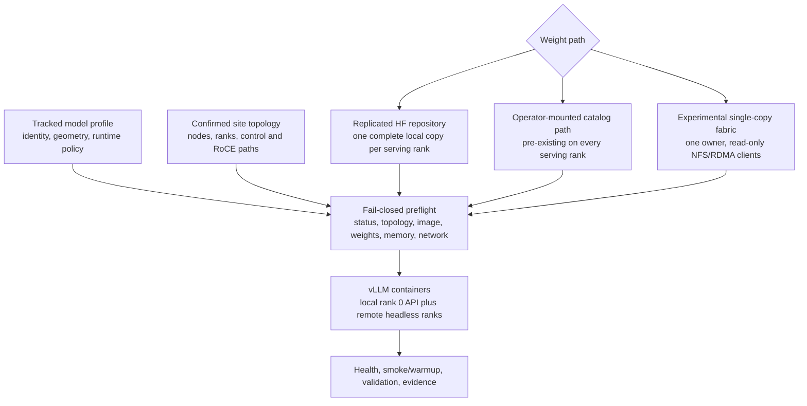

# Pulsar GB10 model catalog, distribution, and loading implementation

**Descriptive implementation snapshot — not the architectural authority**

Accepted model-library architecture lives in
[MODEL_LIBRARY_DESIGN.md](./MODEL_LIBRARY_DESIGN.md) and
[ADR 0001](./decisions/0001-model-library-home-view-and-validation-identity.md).
This document describes current code, evidence, and known gaps. Where current
behavior differs from the accepted target, the difference is labeled as an
implementation gap rather than presented as a competing decision.

| Field | Value |
|---|---|
| Snapshot date | 2026-08-10 |
| Scope | Current repository working tree |
| Hardware target | One or more NVIDIA DGX Spark GB10 systems; validated serving profiles currently use one or two ranks |
| Promoted storage path | Replicated local Hugging Face caches |
| Additional catalog path | Operator-mounted absolute paths, conventionally under `/mnt/Models` |
| Experimental storage paths | Federated durable home plus sealed local hot, and a distinct live NFSv4.2/RPC-RDMA owner path |
| Document status | Descriptive current-system specification; not a promotion or architecture claim |

This document is intentionally self-contained. It describes what the current
code does, which claims have physical evidence, where the boundaries are, and
which implementation questions remain open. It omits site-specific hostnames,
addresses, node identities, user paths, and credentials so it can be shared
externally.

## 1. Authority and review scope

This snapshot supports review of four implementation areas:

1. model-profile catalog behavior for geometry, runtime flags, memory budgets,
   and legacy validation status;
2. the promoted replicated distribution path;
3. the experimental live NFS/RDMA single-copy path; and
4. the experimental transfer-then-load model-library path.

The accepted model-library direction is no longer an open peer-review question:
one durable home per exact revision, a validated durable-home view on the home
rank, sealed hot only on non-home ranks, and content identity anchored in a
lab-issued validation bundle. Routine home-rank hot materialization is ruled
out. Current code implements the reviewed expected-seal reference, exact commit
selection/comparison, seal-bound hot state, exact snapshot launch, and the
rank-local fast metadata witness with visible full-verification fallback. It
does not yet implement a standalone validation-bundle document, and no real
profile seal ships yet.

The model catalog still selects **what to run and how many ranks it needs**.
The guided replicated path has no storage owner. A live NFS/RDMA owner exists
only in its explicit advanced workflow; a model-library **home** is durable
placement and is not necessarily rank 0 or a live export owner.

## 2. Executive summary

Pulsar separates five kinds of state:

| State | Source of truth | Tracked in Git? | Purpose |
|---|---|---:|---|
| Model profile | `models/<profile>.conf` | Yes | Model identity, exact world size, image, engine flags, memory budget, status, and purpose |
| Cluster topology | Confirmed topology manifest | No; site-local | Stable node identities, ranks, control endpoints, RDMA interfaces, rails, and topology identity |
| Weight-fabric configuration | `.weight-fabric/<profile>.json` | No; site-local | Owner, storage-visible nodes, selected RoCE rail, export/mount paths, and configuration identity |
| Model bytes | Local cache, site catalog, or owner cache | No | Hugging Face repository or absolute-path model tree consumed by vLLM |
| Expected model seal | Optional `models/seals/*.json` referenced by a tested profile | Yes | Reviewed exact commit/manifest expectation plus lab provenance and validation-bundle ID |
| Validation evidence | `results/` plus `docs/VALIDATION.md` | Yes when publishable | Reproducible support for status and promotion claims |

The current system supports three practical storage origins:

1. **Hugging Face repository, replicated locally.** The controller downloads
   one complete repository to its standard cache and copies it with `rsync` to
   every remote serving rank. This is the promoted and wizard-guided default.
2. **Absolute-path site catalog.** A profile whose `MODEL` begins with `/` is
   treated as an already-mounted local or NFS catalog path. Pulsar checks it on
   every rank but never downloads or copies it.
3. **Hugging Face repository, single-copy live fabric.** One serving rank is
   explicitly configured as owner. Only the selected model repository subtree
   is exported to exact client RoCE addresses. Clients hard-mount it read-only
   with NFSv4.2/RDMA, and each vLLM container receives only that exact repository
   at the expected Hugging Face cache path. This remains experimental.

There is a naming mismatch worth reviewing. Catalog output calls model origins
`hf` or `nfs`, while launch accepts `--weight-source replicated|fabric`.
`replicated` currently means “not the experimental fabric mode”; it can include
an absolute-path catalog profile and therefore does not always mean physically
replicated bytes. A future interface should probably describe origin,
distribution, and runtime mount as separate axes.

## 3. Architecture and boundaries



The system has three network planes that must not be conflated:

| Plane | Current role |
|---|---|
| Control | SSH, orchestration, Docker commands, inventory, and fault control. Weight-fabric and inventory operations retain a stable SSH/host-key alias but pin the connection to the topology's recorded control address. Some default launch/staging commands still use the saved alias directly; see the limitations section. |
| Inference data | NCCL/Gloo/vLLM distributed traffic. Multi-node profiles require a verified RoCE full mesh and select the confirmed HCAs/interfaces. |
| Weight storage | Local filesystem in replicated/catalog mode; a selected RoCE rail carrying NFS/RDMA in experimental fabric mode. |

The repository is required only on the controller. Remote ranks do not need a
checkout: the controller constructs Docker commands and streams bounded helper
scripts or shell commands over SSH. Remote nodes do need the required OS tools,
Docker image, model bytes or mount, and key-based/attended privileged access as
appropriate.

## 4. Implementation terminology

The terms below describe current implementation behavior. Normative
model-library terminology and future contracts come from the canonical design
and ADR. A statement marked **current limitation** or **implementation gap**
must not be promoted into policy merely because the code currently behaves
that way.

- **Profile**: a trusted shell configuration in `models/`.
- **Model ID**: the `MODEL` value passed to vLLM. It is either a Hugging Face
  repository identifier or an absolute filesystem path.
- **Served name**: the stable name exposed through the OpenAI-compatible API.
- **Rank**: one GB10 process/container participating in the exact distributed
  world. Rank 0 owns the API; ranks 1..N-1 are headless.
- **Serving nodes**: the first `NODES` ranks selected from the confirmed
  topology for a multi-node profile.
- **Storage-visible nodes**: the serving nodes plus optional additional
  confirmed readers configured for single-copy verification or benchmarking.
- **Home**: model-library durable placement for an exact revision. Current
  catalog code may also call this node an owner; the canonical term is home.
- **Owner**: the one serving node running the authoritative live export in
  experimental NFS/RDMA fabric mode.
- **Replicated mode**: the default launch mode, in which Pulsar does not use the
  weight-fabric configuration. For HF profiles every serving node is expected
  to have a complete local repository.
- **Fabric mode**: explicit experimental launch mode in which cold model reads
  use a live NFS/RDMA view of the owner's repository.
- **Sealed snapshot**: a resolved Hugging Face revision plus an exact file list,
  sizes, and SHA-256 digests recorded in a manifest.
- **Expected seal**: optional reviewed schema-1 document under `models/seals/` containing model ID, immutable commit, manifest ID, lab provenance, and validation-bundle ID.
- **Observed seal**: locally computed identity compared with the expected seal;
  it cannot establish validation by itself.
- **Serve witness**: rank-local schema-1 metadata record created only after a
  stable full SHA-256 verification. It accelerates unchanged launches but is
  never an expected-identity source.
- **Runtime source**: target per-rank classification of `durable-home`,
  `sealed-hot`, or `live-mount`.
- **Confirmed topology**: a validated site manifest with stable identity and
  verified connectivity. A missing manifest is not “confirmed one node.”

## 5. Model catalog specification

### 5.1 Source and trust model

Each catalog entry is a shell file named `models/<profile>.conf`. The loader
directly sources it. Profiles are therefore executable trusted repository code,
not untrusted declarative input. IDs are constrained to letters, numbers, dot,
underscore, and hyphen before a file can be selected.

This choice makes arrays and comments easy to maintain but expands the review
surface. A malicious or compromised profile can execute commands when catalog
or launch tools source it. The current security model assumes the repository
and reviewed profile changes are trusted.

### 5.2 Identity and source fields

| Field | Meaning and current rule |
|---|---|
| `MODEL` | Required. Normally passed to vLLM as `--model`. A leading `/` classifies an absolute-path catalog model; otherwise it is a Hugging Face repository. `library-hot` launch instead passes the sealed local `snapshots/<revision>` path. |
| `SERVED_NAME` | API model name. Defaults to the profile ID and may intentionally differ from the repository ID. |
| `EXPECTED_MODEL_SEAL` | Optional path relative to `models/`, constrained under `models/seals/`. Only `STATUS=tested*` may reference one. The strict seal and every repository-relative evidence path must exist. |
| Profile filename | Operator-facing launch ID, for example `scripts/up.sh <profile>`. |
| `PROFILE_FAMILY` | Groups related one-node/two-node or serving/diagnostic variants. Defaults to `SERVED_NAME`. |
| `VARIANT_LABEL` | Human label for a variant. Defaults to `<NODES>-node`. |
| `PROFILE_PURPOSE` | `serving` or `diagnostic`. Defaults to `serving`; the wizard excludes diagnostic profiles. |

`model_source_kind` uses only the leading slash test. The catalog's human/JSON
`source=nfs` label therefore means “absolute path that Pulsar will not
download,” not proof that the path is actually NFS, read-only, or mounted from a
particular server. That transport verification belongs to the operator today.

### 5.3 Exact serving geometry

| Field | Meaning and validation |
|---|---|
| `NODES` | Positive integer exact active rank count. Defaults to 1. |
| `ENGINE_ARGS` | vLLM flags, including tensor and pipeline parallel sizes. |
| `TOPOLOGY_CLASS` | `single` for one node; currently `roce-full-mesh` for multi-node. |
| `MIN_RAILS_PER_PAIR` | Minimum shared RoCE rails for every selected rank pair; defaults to 0 for one node and 2 for multi-node. |
| `PORT` | API port, default 8000. |
| `GPU_MEM_UTIL` | vLLM memory-utilization input, default 0.80. |

The loader computes tensor-parallel size times pipeline-parallel size and MUST
find exactly `NODES`. Multi-node profiles MUST use the native vLLM
`--distributed-executor-backend mp` path and the `roce-full-mesh` topology
class. A mismatch fails while loading the catalog entry, before launch.

The confirmed topology may contain more nodes than the profile needs. A
two-node profile on a three-node topology still launches exactly ranks 0 and 1;
rank 2 is not automatically added. There is currently no guided arbitrary pair
selection for a multi-node profile.

### 5.4 Image and runtime policy

| Field | Meaning |
|---|---|
| `IMAGE` | Container image. Defaults to the repository's mainline vLLM image; specialized profiles may pin an immutable digest. |
| `ENGINE_ARGS` | Normal vLLM engine and API arguments. |
| `CONTAINER_ENV` | Profile-specific container environment variables. |
| `SPEC_DECODE_ARGS` | Validated speculative decoding configuration, if any. |
| `RECOMMENDED_SPEC` | `1` makes the validated speculative path the executable default; `--no-spec-decode` is the rollback. |
| `NOTES` | Human operational caveats. |

Speculative decoding has three catalog-visible states:

- `none`: no validated speculative arguments;
- `optional`: validated arguments exist but remain off by default;
- `recommended`: validated arguments exist and are enabled by profile policy.

An explicit `--spec-decode` is refused when a profile has no validated
`SPEC_DECODE_ARGS`. Contradictory on/off flags are also refused.

### 5.5 Status and guided exposure

`STATUS` is the profile validation ledger state. Only values beginning with
`tested` are ship-default launchable. `blocked*`, `do-not-use`, untested, or
unknown statuses require the explicit `--force` escape hatch.

`scripts/list-models.sh --validated --serving --json` is the wizard's catalog
contract. It applies both gates:

1. status must be `tested*`; and
2. purpose must be `serving`.

A diagnostic canary may therefore be `STATUS=tested` and still be absent from
the normal serving wizard. This is intentional: “tested plumbing” is not the
same claim as “recommended user workload.”

### 5.6 Disk and unified-memory budgets

Profiles may provide:

| Field | Meaning |
|---|---|
| `WEIGHTS_GIB` | Complete on-disk repository estimate used by weight staging. |
| `WEIGHTS_RAM_GIB` | Resident model-weight estimate when disk size is not a good proxy. |
| `KV_GIB` | Per-rank KV cache allocation/estimate. |
| `OVERHEAD_GIB` | Per-rank runtime/engine overhead. |
| `MEM_MIN_FREE_GIB` | Desired residual OS buffer. |

The memory checker derives a per-rank footprint, cold-start spike allowance,
preferred buffer, and hard floor. It distinguishes a cold start from an already
loaded service. Its stable result contract is pass/warn/fail with exit codes
0/2/1. A warning requires an explicit `--accept-memory-warn` for a live launch;
a hard failure has no continue-anyway path. This matters on GB10 because model,
KV cache, runtime, filesystem cache, and OS share unified memory.

### 5.7 Machine-readable catalog contract

`scripts/list-models.sh --json` returns each profile's:

- ID, status, node count, and derived source;
- served name;
- speculative-decoding state and whether it is default-on;
- first-run candidate flag;
- family, variant, and family recommendation;
- topology class and minimum rail count; and
- serving or diagnostic purpose.

It intentionally does not return the full image, engine arguments, memory
budgets, notes, or executable profile body. Consumers requiring launch details
must use the trusted profile loader.

### 5.8 Current catalog snapshot

The current working tree contains ten profiles:

| Profile | Status | Nodes | Origin | Purpose | Offered by normal wizard? |
|---|---|---:|---|---|---:|
| `nemotron-3-nano-30b-nvfp4` | tested | 1 | HF | serving, first-run candidate | Yes |
| `laguna-s-2.1-nvfp4` | tested | 1 | absolute catalog path | serving | Yes |
| `nemotron-3-super-120b-nvfp4` | tested | 1 | HF | serving | Yes |
| `qwen3.6-27b-fp8` | tested | 1 | HF | serving | Yes |
| `deepseek-v4-flash` | tested | 2 | HF | serving | Yes, with confirmed capacity |
| `qwen3-1.7b` | tested | 1 | HF | diagnostic | No |
| `qwen3-1.7b-2node` | tested | 2 | HF | diagnostic plumbing canary | No |
| `inkling-small-nvfp4` | blocked-upstream | 2 | absolute catalog path | serving | No |
| `laguna-s-2.1-2node` | do-not-use | 2 | absolute catalog path | serving | No |
| `qwen3.6-27b-fp8-2node` | do-not-use | 2 | HF | serving | No |

The two-node Qwen 1.7B profile is deliberately inefficient as a serving target.
It exists because a small model can exercise topology, NCCL, native multi-node
vLLM, lifecycle, and storage faults quickly. The stock vLLM v0.26.0 cross-node
CUDA-graph path failed under sustained sampling, so the tested canary now pins
`--enforce-eager`. That runtime workaround is separate from the weight-storage
design.

## 6. Topology, placement, and node identity

### 6.1 Clean standalone state

If no topology manifest or legacy topology exists and the user declines
discovery, the wizard treats the local machine as standalone capacity 1. It
does not create a topology manifest and does not claim cluster membership or a
confirmed node identity. Only validated one-node serving profiles are offered.

The user sees the equivalent of:

```text
1 standalone local node available · no cluster membership confirmed
Choose a validated model · standalone local node
```

The resulting single-node container has no fabricated node ID or topology ID.

### 6.2 Confirmed cluster state

Discovery writes a site-local topology manifest only after explicit operator
confirmation. The manifest captures:

- stable node identity and deterministic rank;
- hostname and SSH alias;
- control address and interface;
- active RDMA devices/interfaces;
- verified pairwise rails and networks;
- topology validation class, minimum rails, and identity digest.

Multi-node launch requires enough confirmed ranks, a full mesh, and the
profile's minimum rails for every selected pair. It derives exact HCAs for the
selected rank subset. Network reachability, Docker/GPU readiness, weights,
memory, and image presence are rechecked before mutation.

The shared confirmed-endpoint helper uses the saved alias for user configuration
and host-key identity but forces the connection endpoint to the saved control
address. Weight-fabric and inventory operations use this helper, preventing
name-resolution drift from silently moving their management traffic onto a
RoCE rail that a fault test may take down. Core cluster launch, preflight,
image sync, and replicated weight staging still invoke the saved alias directly;
control-endpoint pinning is therefore not yet uniform across the repository.

### 6.3 Placement rules

- A one-node profile MAY run locally or on a selected confirmed physical node.
- In standalone mode, an empty selector means the local machine.
- In confirmed mode, the preferred selector is the stable node ID; exact
  hostname, SSH endpoint, control address, or role key is also accepted.
- A multi-node profile always uses its exact first `NODES` ranks. `--node` is
  rejected for multi-node profiles.
- Fabric owner selection is separate and MUST select one of the exact serving
  ranks. An idle storage-only third node cannot be the owner in schema 2.

## 7. Storage and distribution modes

### 7.1 Comparison

| Property | Replicated HF cache | Absolute-path catalog | Experimental live fabric |
|---|---|---|---|
| Guided default | Yes | Yes when a validated profile already references it | No |
| Model origin | Hugging Face repository ID | Operator-managed absolute path | Hugging Face repository ID |
| Durable copies | One full repository per serving node | Defined by external catalog operator | One authoritative repository on owner; complete client replicas forbidden |
| Distribution | Controller downloads, then `rsync`s selected repository to remote ranks | Out of scope; mount/provision before Pulsar | Owner-only download; NFS/RDMA export/mount applied explicitly |
| Container view | Full local HF home, writable; site catalog also mounted read-only | Site catalog mounted read-only | Only selected HF repository mounted read-only at its exact cache location; broader HF home excluded |
| Cryptographic seal | No | No | Yes, exact revision/file set/sizes/SHA-256 |
| Cold-start owner dependency | No after local staging | Depends on external catalog | Yes |
| Steady-state owner dependency | None | Depends on external catalog semantics | Loaded service may continue, but reload/restart and hard-mounted I/O depend on owner |
| Automatic fallback | Not applicable | None | None; explicit replicated staging and launch required |
| Current status | Promoted | Per-profile validation | Experimental |

### 7.2 Default replicated Hugging Face workflow

For an HF profile, `scripts/pull-weights.sh` performs this sequence:

1. Load and validate the profile.
2. Resolve one-node placement or require the exact confirmed multi-node ranks.
3. Require `hf` or `huggingface-cli` on the controller.
4. Estimate required free disk from `WEIGHTS_GIB`, accounting for an existing
   partial local repository, and require a full-copy allowance on each remote.
5. Ask for confirmation unless `--yes` was explicitly supplied.
6. Run `hf download <MODEL> --cache-dir <HF cache>/hub` on the controller with
   online access enabled for the command.
7. Copy the selected `models--publisher--model` repository directory to each
   remote serving rank using `rsync -aH`.
8. Run the normal per-rank weight check and fail if any rank is missing,
   partial, unreachable, or unconfirmed.

Every serving rank needs the complete repository on disk even though vLLM may
shard the resident tensors across ranks. Tensor parallelism changes the runtime
memory geometry; it does not currently change the download artifact.

For a one-node profile placed on a remote confirmed node, the controller still
downloads/stages the source repository locally and copies it to that node. The
controller copy may remain afterward. This is a convenience of the current
implementation, not a declared cache-retention policy.

The completeness checker verifies:

- a valid `refs/main` pointing at an existing snapshot directory;
- no `*.incomplete` marker;
- readable non-empty root or discovered `config.json`;
- at least one non-empty recognized weight file (`safetensors`, `bin`, or
  `gguf`); and
- if a weight index is present, every referenced shard exists and is non-empty.

It does **not** calculate hashes, prove that every remote rank resolves exactly
the same revision, reject extra files, or bind the repository to a profile lock
file. The copy workflow normally produces equivalent trees, but the launch gate
is a structural completeness check rather than a cryptographic parity check.

### 7.3 Absolute-path catalog workflow

If `MODEL` begins with `/`, Pulsar treats it as an existing local/catalog path:

- `pull-weights.sh` refuses to download or copy it;
- the operator must mount/provision the path on every required serving node;
- `check-weights.sh` performs the same structural completeness check directly
  against the path on every rank;
- the container sees `MODELS_NFS` (default `/mnt/Models`) read-only; and
- the profile's absolute `MODEL` path is passed unchanged to vLLM.

The stack does not currently verify the catalog server identity, mount source,
mount protocol/options, revision parity, or availability policy. It also mounts
the broader configured catalog root into the container, not only the selected
model subtree. Those responsibilities and the resulting trust boundary are
external to Pulsar today.

### 7.4 Experimental single-copy NFS/RDMA workflow

The experimental path is designed to answer a specific question: can multiple
GB10 ranks load one ordinary Hugging Face/SafeTensors repository over RoCE
without converting the checkpoint or maintaining durable client replicas?

It does not share KV cache, replace NCCL inference traffic, stream tensors
directly into the GPU, or use GPUDirect Storage. It preserves ordinary POSIX
paths, symlinks, reads, and `mmap` behavior while changing the backing
filesystem transport.

Fabric mode currently supports only multi-node profiles whose `MODEL` is a
two-component Hugging Face repository ID. It does not wrap absolute catalog
profiles or one-node profiles.

## 8. Weight-fabric configuration specification

### 8.1 Configuration creation

An operator first confirms cluster topology, then runs:

```bash
scripts/weight-fabric.sh configure <profile> \
  --owner <confirmed-topology-node-id> \
  [--storage-nodes <count>]
```

The owner selector is mandatory and may identify a serving rank by stable node
ID, rank, hostname, SSH endpoint, or control address. The generated site-local
schema-2 JSON records:

- schema version;
- topology identity;
- profile and Hugging Face repository ID;
- exact serving node count;
- storage-visible node count;
- owner rank, stable identity, host metadata, and cache root;
- transport kind, RPC/RDMA port, rail index, exact export path, mount root,
  mount path, and mount options;
- per-client server/client RoCE addresses, HCAs, netdevices, and network;
- rank roles and synthetic client cache roots;
- manifest path;
- explicit replicated fallback name and experimental promotion status; and
- a SHA-256 configuration identity over all other fields.

The entire configuration is rebuilt from the current confirmed topology during
validation. Any content difference, topology identity drift, model/profile
mismatch, node-count mismatch, or digest mismatch fails closed and requires
reconfiguration.

`storage_nodes` defaults to the profile's serving count and may extend through
the confirmed topology count. It cannot be less than the serving count. Extra
storage-visible ranks participate in readiness and optional concurrent loading
tests but are not added to the vLLM world.

### 8.2 Path layout

For model `publisher/model`, the owner keeps the normal repository:

```text
<owner-cache>/hub/models--publisher--model/
  refs/main
  snapshots/<revision>/...
  blobs/...
  .pulsar/manifests/<profile>.manifest.json
```

Only `models--publisher--model/` is exported. The client's synthetic cache root
is namespaced by profile and topology identity, and the mount is placed at:

```text
<client-mount-root>/<profile>-<topology-prefix>/hub/models--publisher--model/
```

At launch, only that exact client repository is bind-mounted to:

```text
/root/.cache/huggingface/hub/models--publisher--model:ro
```

The broader Hugging Face home, sibling repositories, and token files are not
exported or mounted in a fabric-mode container. Legacy schema-1 configurations
that exported the full cache are teardown-only; show, check, apply, benchmark,
and launch reject them.

### 8.3 Rail selection and mount contract

For each owner/client pair, the configuration deterministically sorts the
confirmed rails and selects one `rail_index`. The route to the owner server
address MUST use the recorded client RoCE netdevice and source address.

Clients mount the exact owner export with:

```text
ro,vers=4.2,proto=rdma,port=20049,hard,timeo=600,retrans=2
```

The port is configurable but defaults to the standard RPC/RDMA NFS port 20049.
There is no TCP or control-LAN fallback. A wrong route, mount source, protocol,
version, option, path, or port blocks readiness and launch.

### 8.4 Export and Unix identity contract

`apply` installs a configuration-specific export file and NFS daemon fragment
on the owner. Each configured client RoCE address receives this policy:

```text
ro,sync,insecure,root_squash,anonuid=<repository-owner-uid>,
anongid=<repository-owner-gid>,no_subtree_check
```

The implementation:

- refuses a root-owned authoritative repository;
- retains `root_squash` and never enables `no_root_squash`;
- maps squashed container root to the verified non-root repository owner;
- verifies that this identity can traverse all directories, read all regular
  files and in-repository link targets, and cannot follow a link outside the
  repository;
- scopes access to exact client RoCE addresses;
- rejects another Pulsar export file or an active export of the Hugging Face
  home/another parent of the selected repository; and
- verifies the active kernel export table after NFS refresh/restart.

The `insecure` option is required for this RPC/RDMA client behavior; it is not a
claim of network authentication. The design assumes a trusted lab network.

### 8.5 Sealed manifest

`download` runs the Hugging Face CLI only on the owner and then seals the
resolved snapshot. `seal` may also be run explicitly. The manifest contains:

- schema version, profile, and model;
- resolved snapshot revision;
- every logical snapshot path;
- each file's exact size and SHA-256 digest;
- file count and total bytes; and
- a manifest identity digest.

Sealing fails on an incomplete marker, missing root config, missing recognized
weight file, invalid weight index, empty file, unsafe path, missing referenced
shard, or link/path escape.

Routine launch readiness performs metadata/file-set/size verification. Full
`verify` rereads and hashes every file on every selected node. This separation
keeps every launch from paying a complete checksum read while retaining a
strong explicit validation command.

### 8.6 Apply as a bounded distributed transaction

Before its first system write, `apply` checks:

1. prerequisites and privilege availability;
2. sealed manifest presence;
3. owner identity and complete mapped-identity readability;
4. absence of broader/conflicting exports;
5. every configured client route;
6. absence of a complete durable client repository; and
7. unoccupied or already-exact mount targets.

After confirmation it:

1. writes the configuration-specific export and NFS/RDMA daemon files;
2. loads server RPC/RDMA support;
3. refreshes exports, enables/restarts NFS, and verifies port readiness;
4. verifies the exact active export and absence of a broader surface;
5. mounts every client using the exact hard NFSv4.2/RDMA options; and
6. runs the metadata readiness check across all configured storage nodes.

Once the first system file is written, an exit trap is armed. A later failure
triggers best-effort removal of this configuration's exact mounts and owner
files. An incomplete rollback remains explicit and requires teardown. This is
not an atomic distributed transaction, but partial state is not silently
reported as ready.

The applied files and enabled NFS service persist across reboot. This is a host
configuration change, not a process-local experiment. `teardown` removes only
this configuration's export/mount state and preserves both the authoritative
model repository and site-local JSON.

### 8.7 Readiness state

`check` covers all configured storage-visible ranks by default;
`check --serving-only` limits the view to vLLM ranks. A ready fabric requires:

- owner repository identity and access pass;
- no broader/conflicting export;
- NFS/RDMA server listening on the exact port;
- exact active export policy;
- exact route and mount on every client;
- manifest verification at the requested metadata or full level; and
- no complete durable local model repository on a client.

Representative fail-closed states include `owner-unready`, `route-mismatch`,
`unmounted`, `replica-present`, and `integrity-failed`. No state automatically
creates replicas, remounts over TCP, or changes the owner.

## 9. Operator workflows

### 9.1 Clean clone, local standalone

```text
clone repository
  → run ./pulsar wizard
  → doctor checks local prerequisites
  → decline cluster discovery
  → see only validated one-node serving profiles
  → choose model and local placement
  → check/download HF weights or verify absolute catalog path
  → check/sync image
  → inventory and cold-memory preflight
  → final confirmation
  → launch local container, health check, smoke
```

No topology file or cache-owner choice is needed. Each weight, image, stop, and
launch mutation has its own confirmation. Declining the final launch leaves
containers unchanged, although model/image preparation already approved by the
operator may remain on disk.

### 9.2 Confirmed multi-node, replicated default

```text
run discovery and explicitly write confirmed topology
  → run wizard or select profile directly
  → choose a validated multi-node serving profile
  → controller downloads selected HF repository
  → controller copies repository to every remote serving rank
  → image, weights, topology, memory, and cluster preflight pass
  → remote headless ranks start first
  → local rank 0 starts API
  → health, warmup, and validation
```

The wizard states that each serving node reads its own durable copy and that
single-copy storage is an experimental CLI opt-in. It does not ask for an
owner and never switches to fabric automatically.

### 9.3 Absolute-path site catalog

```text
operator provisions identical readable path on each serving node
  → choose a validated absolute-path profile
  → Pulsar verifies structural completeness on every rank
  → container receives the configured catalog root read-only
  → vLLM opens the profile's absolute path
```

Pulsar provides guidance if the conventional catalog mount is absent but does
not create, repair, authenticate, or validate the external catalog service.

### 9.4 Experimental single-copy fabric

```bash
scripts/weight-fabric.sh configure <profile> \
  --owner <topology-node-id> \
  --storage-nodes <count>

scripts/weight-fabric.sh prerequisites <profile>
scripts/weight-fabric.sh setup-prerequisites <profile>   # only if needed
scripts/weight-fabric.sh download <profile>
scripts/weight-fabric.sh apply <profile>
scripts/weight-fabric.sh verify <profile>

scripts/up.sh <profile> --weight-source fabric
```

Prerequisite setup installs only missing Python/NFS packages and an owner-local
Hugging Face CLI environment. The owner requires `nfs-kernel-server`; clients
require `nfs-common` and RPC/RDMA kernel support. Pulsar does not modify sudoers.
Sites requiring passwords use the explicit attended sudo mode.

Before returning to replicated mode, the operator must stage replicas and
explicitly select them:

```bash
scripts/pull-weights.sh <profile> --weight-source replicated --yes
scripts/up.sh <profile> --weight-source replicated
```

Fabric failure never runs those commands on the operator's behalf.

### 9.5 Diagnostic profiles

Diagnostic canaries are intentionally absent from the serving wizard. An
operator invokes them directly, for example:

```bash
scripts/up.sh qwen3-1.7b-2node --weight-source fabric
```

This keeps storage and multi-node plumbing experiments from being presented as
user workload recommendations.

## 10. Launch and loading specification

### 10.1 Preflight order

`scripts/up.sh` is the public orchestration boundary. It performs, in order:

1. profile load and contract validation;
2. status gate (`tested*`, unless explicitly forced);
3. one-node placement resolution or exact multi-node topology gate;
4. image presence on every serving rank, with explicit pull/sync if requested;
5. weight readiness using the selected storage mode;
6. per-rank memory preflight;
7. multi-node network/GPU/Docker/weight preflight; and
8. launch or a non-mutating dry-run.

Skipping weights or cluster preflight is available only as an explicit expert
flag. Fabric launch still performs its own configuration/readiness validation
inside the cluster launcher.

### 10.2 Container filesystem views

**Single-node/default:**

- local Hugging Face home mounted at `/root/.cache/huggingface`;
- configured site catalog root mounted at `/mnt/Models:ro`;
- offline mode enabled by default;
- HF token is available to the single-node container when configured; and
- the container is labeled as stack-managed and `weight-source=replicated`.

**Multi-node replicated/default:**

- each rank's local Hugging Face home mounted at the normal container cache
  path;
- site catalog root mounted read-only;
- offline mode enabled by default; and
- model resolution occurs independently against each rank's local filesystem.

**Multi-node fabric:**

- the broader host Hugging Face home is not mounted;
- only the selected repository is mounted read-only at its exact expected cache
  directory;
- site catalog root is still mounted read-only for existing profile
  compatibility; and
- labels record `weight-source=fabric`, owner identity, and configuration ID.

### 10.3 Multi-node process construction

The launcher uses native vLLM multi-node arguments with one Docker container per
GB10:

- `--nnodes <NODES>`;
- `--node-rank <rank>`;
- remote ranks add `--headless`;
- rank 0 exposes the OpenAI-compatible API;
- `--master-addr` uses rank 0's confirmed control address;
- NCCL is forced to IB/RoCE and exact selected HCAs;
- NCCL, Gloo, and tensor-parallel sockets use the confirmed control interface;
- profile engine and speculative-decoding arguments are appended unchanged.

Remote ranks start first. Rank 0 starts only after their Docker runs return
valid immutable container IDs. Every container receives ownership labels for
profile, rank, world size, topology, physical node identity, and weight source.

Before replacement, Pulsar discovers containers with the exact generated name
and removes them only if stack ownership, profile, rank, world size, and
physical placement can be proven. Ambiguous or unlabeled containers are never
blindly removed.

### 10.4 Load, health, and warmup

vLLM opens the profile's model path and loads the checkpoint into GB10 unified
memory according to the configured tensor/pipeline geometry. In fabric mode,
the first uncached reads traverse the hard NFS/RDMA mount. In replicated mode,
they use each node's local filesystem. Filesystem page cache state therefore
materially affects cold-start measurements.

The launcher waits for rank 0 `/health` while continuously checking that all
rank containers remain running. Container liveness alone is not accepted as
engine health. If a rank dies, the launcher captures logs and removes only the
immutable IDs created by that invocation.

After health:

- the normal multi-node path runs a short/medium, stream/sync warmup suite; or
- `--skip-warmup` runs one smoke completion only.

Optional startup evidence records profile, model, storage mode, node count,
topology ID, cache-state label, start/healthy timestamps, and time to first
health. Live-fabric evidence additionally requires configuration and owner
identity. `library-hot` evidence requires home/content identity, transfer and
integrity scheme, exact model revision, identity status, and the exact runtime
snapshot path; `match` also requires model-seal and validation-bundle IDs.

Once all model weights are resident, ordinary inference has been observed to
continue without rereading the checkpoint. That is not a guarantee that every
future code path is storage-independent: restart, reload, eviction, or an
incompletely loaded service still depends on the configured source.

## 11. Lifecycle and failure semantics

### 11.1 General invariants

- No missing topology, image, weights, memory, or fabric state is silently
  guessed into readiness.
- No storage failure changes the selected mode automatically.
- No launcher cleanup removes a container whose ownership cannot be proven.
- Signal interruption removes only launch-recorded immutable IDs.
- A successful Docker start is not a successful service; `/health` and smoke or
  warmup are required.
- Results from failed runs are preserved when safe, not overwritten as passes.

### 11.2 Fabric fault matrix

| Scenario | Expected behavior | Required recovery proof |
|---|---|---|
| Interrupted owner download | Incomplete marker, missing shard, changed ref, or manifest mismatch blocks sealing/launch. | Resume owner-only download, reseal, and full-verify. |
| Interrupted cluster start | Service never reports healthy; signal/failure cleanup removes only IDs from this invocation. | Idle inventory, full storage verify, successful relaunch, correctness gates. |
| Configured RoCE route/link absent before launch | Route or mount gate fails. No TCP/control fallback. | Restore exact netdevice, full check, traffic proof. |
| Link loss during cold read | Hard I/O blocks or caller fails; no incomplete service becomes healthy. | Restore link, exact read completion or explicit failure, checksums, relaunch and gates. |
| Owner NFS restart | Hard clients wait; a fully resident service may remain healthy but a loader cannot complete until recovery. | RDMA port/export/mount restored, client read completion, full verify, relaunch and gates. |
| Owner reboot | Owner-local rank/export disappear; independent client hard read should wait and resume after owner recovery. Cold start is unavailable while owner is down. | Changed boot identity, observed outage, storage readiness, full OS boot policy, manifest integrity, no replicas, ownership-safe relaunch and serving gates. |
| Client durable replica appears | Fabric readiness becomes `replica-present`. | Stop services, use guarded client-only purge or explicitly choose replicated mode. |
| Topology/configuration drift | Configuration validation fails before launch. | Reconfirm topology and explicitly reconfigure; never edit identity fields in place. |

## 12. Integrity, provenance, and evidence

### 12.1 Replicated/catalog integrity level

The default path provides structural presence/completeness checks. It does not
currently create a cryptographic model lock or publish per-rank digest parity.
Model repository IDs are present in profiles, but a mutable upstream `main`
revision is not pinned by the profile or download command.

Model-library catalog schema 2 closes the repository-ID-only trust gap when a
profile references a reviewed seal: refresh enumerates complete snapshot
commit directories without using mutable `refs/main`, selects only the
immutable expected commit, and labels the local home `expected-unverified`.
Activation inspects that same revision explicitly, computes the observed
complete manifest, requires model/revision/manifest equality, and publishes
hot schema 3 only after full verification. A configured mismatch cannot be
bypassed with `--allow-unvalidated`.

Profiles without a seal remain `legacy-unsealed`, including every current
production profile. Their historical `STATUS=tested*` claim does not
machine-bless arbitrary content and library activation requires explicit
`--allow-unvalidated`. Replicated mode still has no equivalent content lock.
The seal carries an opaque reviewed validation-bundle ID; current code does not
yet validate a standalone bundle document containing normalized profile,
resolved image digest, and geometry.

### 12.2 Fabric integrity level

Fabric configuration, topology, and model content have separate identities:

- `topology_id`: confirmed physical/network layout;
- `configuration_id`: owner, ranks, rail, paths, mount contract, and topology;
- `manifest_id`: exact snapshot revision and file contents.

These identities flow into checks, container labels, startup evidence, and
benchmarks. Routine metadata checks require the exact file set and sizes; full
verification hashes every byte.

### 12.3 Traffic proof

The storage benchmark performs concurrent complete snapshot reads and records
logical bytes, per-rank timing, CPU/memory samples, configured HCA counters, and
control-interface counters. Cold fabric evidence must show model-sized client
HCA receive traffic, corresponding owner HCA transmit traffic, and bounded
control-LAN traffic.

ConnectX RPC/RDMA traffic bypassed Linux Ethernet netdevice byte counters in
physical testing, so positive proof uses InfiniBand HCA port counters with the
documented four-octet conversion. Netdevice counters remain useful for bounding
control traffic, not proving RDMA payload.

### 12.4 Public evidence privacy

Raw site configuration and fault staging remain private. Publishable artifacts
replace node identities with deterministic fingerprints and omit hostnames,
SSH targets, addresses, cache/export/mount paths, and tokens. The artifact
auditor rejects private field names or exact known private values before a
bundle is considered shareable.

## 13. Current validation status

The following is the implementation/evidence state as of the snapshot date.
The Qwen 1.7B two-node `STATUS=tested` row is a historical runtime-profile
claim; it neither machine-binds arbitrary Qwen snapshots to that evidence nor
promotes any experimental storage path for general users.

| Gate | Current result | Interpretation |
|---|---|---|
| Replicated local cache workflow | PASS / promoted default | Used by wizard and serving workflows. |
| Schema-2 model-repository export | PASS on physical hardware | Exact subtree, root-squash mapping, client/container readability, sibling/token exclusion. |
| Two-node cold fabric read | PASS, 2.11 logical GiB/s | Same 4,079,450,110-byte sealed canary snapshot on both ranks with symmetric HCA traffic. |
| Two-node cold replicated read | PASS, 4.84 logical GiB/s | Fabric delivered about 43.6% of replicated throughput; maximum-rank read took about 2.29× as long. This is storage I/O, not startup or inference. |
| Final-profile cold fabric first health | PASS, 105.731 s | Includes container/distributed initialization and model load; not directly comparable with the recorded warm replicated start. |
| Fabric vs replicated resident serving | PASS | 30/30 greedy outputs identical with zero logprob delta; c=8 aggregate throughput 608.57 vs 607.37 tok/s (about 0.2% difference). |
| Interrupted start/recovery | PASS | Exit 130, exact tracked-ID cleanup, no false success metric, full reverify and correctness recovery. |
| RoCE link loss/recovery | PASS | Bounded 10.518 s selected-link outage during paced read; control path remained independent; post-fault serving gates passed. |
| NFS service restart/recovery | PASS | Bounded 10.046 s outage; hard client resumed exact read; post-fault serving gates passed. |
| Owner reboot storage recovery | Storage PASS; automatic full boot FAIL | Client read, NFS/RDMA, export, Docker, and later serving recovered, but the headless graphical boot stalled on the GDM/Plymouth handoff and required intervention. |
| Connected-display owner boot policy | PASS twice | A real display present before boot produced automatic GDM/Plymouth completion in 3.218 s and 3.252 s with full storage verification. This is a mitigation, not a headless fix. |
| Owner-reboot fault with display attached | PENDING | Must repeat storage interruption and post-reboot serving gates before the owner-reboot promotion box can pass. |
| Three-node concurrent loading/traffic proof | PENDING | Three ranks pass readiness/full integrity, but concurrent three-node promotion evidence remains required. |
| Restart loop and sustained fabric soak | PENDING | Required before general promotion. |
| Full control-plane self-test | PASS | Bash/Python syntax, focused suites, ownership/lifecycle tests, and full `scripts/selftest.sh` pass for the current changes. |

The headless boot issue is currently classified as an owner operating-system
boot-policy problem, not loss of model bytes or failed NFS recovery. That
distinction is operationally useful but does not relax the promotion gate: a
storage owner must recover according to the declared host policy without manual
repair.

## 14. Security and operational trust boundaries

1. **Profiles are code.** Anyone who can change a profile can execute shell in
   tools that source it and can alter image/runtime behavior.
2. **Hugging Face credentials are host secrets.** Tokens and `.env` files must
   not enter Git or public evidence. Fabric exports deliberately exclude token
   files and the wider HF home.
3. **NFS/RDMA is trusted-lab transport.** Exact-address read-only exports and
   `root_squash` reduce exposure; they do not provide cryptographic peer
   authentication or encryption.
4. **The API binds broadly.** vLLM listens on `0.0.0.0:<PORT>`. Use API-key
   support and an authenticating proxy or keep it on a trusted lab network.
5. **Host writes are explicit.** Prerequisite installation, export creation,
   NFS service restart, cache dropping, unmount, purge, and teardown require
   confirmation/privilege. Pulsar does not alter sudoers.
6. **Hard mounts trade fail-fast for resumability.** During an owner/link outage,
   I/O can block for an extended period. The fault harness must be bounded and
   independently recoverable.
7. **Catalog-path isolation is weaker.** Absolute-path profiles mount the
   configured catalog root read-only rather than the exact selected subtree.
8. **Container cleanup is label- and identity-bound.** An ambiguous name match
   is left for manual inspection rather than force-removed.
9. **The witness is trusted site-local control state, not a signature.** Its
   canonical digest detects corruption and its metadata detects ordinary model
   drift, but it does not defend against an actor who can deliberately rewrite
   both model bytes and the user-owned witness. Such host/control-state
   compromise is outside this accelerator's trust boundary and requires a fresh
   full verification from reviewed state (or future protected storage such as
   fs-verity).

## 15. Known limitations and design tensions

### 15.1 Origin, transfer, runtime source, and retention are separate

Current `source=hf|nfs` and `--weight-source replicated|fabric` values mix
several independent facts. The accepted conceptual axes are:

- **origin**: `huggingface | cold-catalog | managed-home`;
- **transfer**: `preexisting | ssh-control | ssh-roce | nfs-rdma`;
- **runtime source**: `durable-home | sealed-hot | live-mount`;
- **retention**: `durable | ephemeral | pinned`.

Current CLIs and JSON do not yet expose this complete vocabulary. In
particular, SSH/TCP over a confirmed RoCE endpoint is `ssh-roce`, while live
NFS/RDMA is a distinct runtime dependency.

### 15.2 Owner choice is outside the catalog and wizard

This is intentional today because the default has no owner and fabric is not a
guided feature. If fabric becomes user-facing, the product must add an advanced
workflow that explicitly asks which confirmed serving node owns the cache,
explains why that choice matters, shows existing copy/free-space/boot evidence,
and confirms storage-visible scope. Silently electing an owner would create an
availability and capacity policy that profiles do not currently express.

### 15.3 Model identity binding: implemented mechanism, no issued release seals

Profiles may now reference a reviewed schema-1 expected seal with immutable
commit, complete manifest ID, validation-bundle ID, issuer, issuance time, and
repository-relative evidence. Catalog schema 2 stores expected identity and
observed availability separately. Hot schema 3 stores expected and observed
seal projections with `match | legacy-unsealed | unvalidated`; file or profile
seal drift fails activation/launch, and launch passes the exact snapshot path.
Container labels and multi-node startup evidence carry the same identities.

No real profile seal is issued in this release, so existing profiles remain
legacy-unsealed and downloads still default to upstream `main`. Replicated and
live-mount paths are not yet bound by this mechanism. Rank-local witness schema
1 is implemented for `library-hot`: activation full-verifies before atomic
creation, and launch validates the live profile/controller expectation before
using it. A metadata match hashes zero model bytes. Missing, malformed, or
drifted metadata is reported on stderr, then full-verifies and atomically
refreshes only on success; content mismatch fails without refresh. Persisted
`drift | mismatch` inventory states, per-rank runtime-source/witness labels,
and a standalone machine-validated bundle for normalized runtime
configuration, resolved image digest, topology class, and evidence remain
gaps. A local observed manifest may match an expected seal but cannot issue it.

### 15.4 Live owner dependency

Single-copy live mounting saves durable client disk but makes the owner and NFS
service part of cold-start/restart availability. Hard mounts improve read
continuity across bounded outages but can block loaders and operator commands.
The owner is also a serving rank, so an owner reboot removes both storage and a
distributed compute rank at once.

### 15.5 Distribution efficiency vs resilience

Replicated mode consumes `N × repository size` disk and transfer time but gives
each rank independent restart access. Live fabric stores one copy but measured
lower cold read throughput and adds network/service/boot failure modes. Resident
inference parity does not remove those cold-path differences.

### 15.6 Fixed serving subset

Multi-node profiles use the first `NODES` topology ranks. An operator cannot
currently choose any validated pair from a larger cluster through the normal
interface. Fabric may expose an extra third reader for validation, but cannot
make it a serving replacement without topology/profile reordering.

### 15.7 External catalog is only lightly specified

Absolute-path profiles rely on externally managed mount identity, consistency,
security, and recovery. Pulsar checks readable model structure, not the backing
filesystem contract. The broad catalog root mount also exposes more read-only
content to the container than the fabric subtree design permits.

### 15.8 Host NFS coexistence

Fabric apply installs configuration-specific files and restarts/enables the
host NFS service. It guards against broader/conflicting Pulsar exports and
parent exports of the selected repository, but the operational effect of an
NFS restart on unrelated host exports remains a site concern.

### 15.9 Repository distribution

Only the controller needs the Git checkout, which reduces drift and onboarding
work. It also makes that controller the orchestration source of truth. Remote
commands depend on compatible packages, paths, Docker state, SSH policy, and
the confirmed topology rather than a locally checked-out script version.

### 15.10 Confirmed endpoint and SSH identity coverage

Topology schema 2 records each confirmed node's host public keys and derived
fingerprints. A generated `.cluster-ssh-config` maps every stable alias to the
exact saved control address and supplies the enrolled key set through
`KnownHostsCommand`. The shared topology loader validates that config byte for
byte before adding it to every normal cluster, image, inventory, weight, and
model-library SSH caller. Missing or stale generated state fails closed.

SSH-over-RoCE overrides only `HostName` with a confirmed rail address while
retaining the topology alias as `HostKeyAlias`. Pair-specific rails in an
N-node mesh are checked from the confirmed opposite peer with a strictly pinned
jump connection; the controller is not assumed to route every point-to-point
subnet directly. Ordinary discovery remains schema 1 and cannot silently
create enrolled trust.

The required topology identity record for each node is:

- immutable `node_id`;
- stable `ssh_host` alias used as the host-key lookup identity;
- one or more accepted public host-key fingerprints, including key algorithm;
- confirmed control address/interface; and
- confirmed RoCE addresses/interfaces/HCAs.

Every SSH connection must select the transport address separately from the
trusted identity, equivalent to `HostName=<selected-address>`,
`HostKeyAlias=<ssh_host>`, and `StrictHostKeyChecking=yes`. The presented key
must match the fingerprint set enrolled for the same immutable node ID. This
contract applies equally to control SSH, rsync subprocesses, probes, and
SSH-over-RoCE bulk streams; callers must converge on one shared resolver.

Doctor and preflight must classify drift deterministically and fail closed:

| Observation | Classification | Required operator action |
|---|---|---|
| RoCE address changed; node ID and enrolled key unchanged | Stale endpoint | Review discovery and explicitly rewrite confirmed topology |
| SSH alias changed; node ID and enrolled key unchanged | Rename | Confirm the rename and rewrite topology explicitly |
| Host key changed; node ID unchanged | Reimage or intentional key rotation until proven otherwise | Verify out of band, then explicitly re-enroll the key |
| Node ID changed at a known alias/address | Replacement node | Re-qualify membership and confirm a new topology |
| A RoCE address presents another confirmed node's key | Wrong-node/address collision | Stop immediately and repair addressing/topology |

First-time setup may discover aliases and endpoints, but only
`scripts/topology-ssh-trust.sh enroll` may create schema 2. Enrollment retrieves
keys through normal, already-trusted OpenSSH on the exact control address,
verifies machine identity and every control/RoCE binding, displays the proposed
fingerprints, and requires confirmation. A changed key is rejected unless the
operator first verifies it out of band, updates normal OpenSSH trust, and uses
`--accept-key-change`; neither setup nor doctor can silently accept it.

The deterministic drift/rotation/collision suite and a 15-binding physical
three-node check passed on 2026-08-10. A Qwen 1.7B two-node canary then activated
a 4,079,450,110-byte sealed snapshot with eight SSH-over-RoCE streams in nine
seconds and full-verified both ranks. See
`results/model-library/topology-ssh-trust-gate-20260810.json`.

## 16. Implemented experiment: transfer then materialize

The model-library experiment implements NFS/RDMA as a one-shot transfer plane
alongside a control-path copy backend:

1. keep one authoritative complete catalog home with an inventory identity;
2. seal the exact snapshot paths, sizes, and file contents with SHA-256;
3. transfer and full-verify it in an isolated local staging root on each
   non-home serving rank;
4. atomically create a rank-local serve witness under stable metadata;
5. optionally unmount/release the transfer plane; and
6. launch vLLM from the verified hot paths.

This removes hard NFS mounts from the runtime. The implementation includes
federated warm catalog discovery, an optional cold tier, copy and fabric
activate backends, schema-3 expected/observed full-content hot seals,
transfer-plane release,
budget checks, pin/unpin/purge, and `library-hot` launch/stop hooks.
Remote serving ranks receive temporary or pinned hot copies, giving up the
strict “one physical copy” property while staged.

Accepted architecture and current behavior both use a warm-home symlink into
the durable HF cache. This is not a materialization gap: routine home-rank hot
copying is prohibited. The control plane now binds that view to an optional
reviewed expected seal, full-verifies it, creates a rank-local metadata witness,
launches the same exact revision, and exposes seal/bundle identity in labels and
startup evidence. The witness binds the canonical hub and snapshot paths,
directory device/inode identity, exact logical files, and per-file
device/inode/size/mtime/ctime. Launch checks the current validation identity
before the fast path; drift visibly rehashes and refreshes only after a stable
match. Remaining promotion work is to issue real release seals, add active
home-removal protection, and complete physical no-follow lifecycle evidence.
Production budget policy, crash recovery, garbage collection, and per-rank
witness/runtime-source inventory also require promotion-level hardening.

The witness is a separate site-local
`<instance>/.pulsar/witness.json`; hot schema 3 is unchanged because one
shared hot stamp cannot truthfully carry rank-specific inode/device values.
Witness schema 1 has strict identity fields for profile, model, revision,
topology, home, content, manifest, and validation provenance; a `view` object
for logical/canonical hub and snapshot paths plus directory device/inode; a
sorted `files` array with logical path and resolved-file
device/inode/size/`mtime_ns`/`ctime_ns`; counts; verification time; and a
canonical-JSON `witness_id`. The `verify-hot --refresh-witness` trust-boundary
mode always hashes and refreshes atomically. The
`verify-hot --serve-time-witness` launch mode reports
`witness.status=match|refreshed` and
`integrity.mode=witness|full`. These site paths and filesystem identifiers
must never be copied into publishable evidence.

This path is implemented but experimental and unpromoted. It must continue to
be evaluated against replicated mode and live fabric rather than being assumed
to supersede either one. In particular, the one-shot `nfs-rdma` backend cannot claim the fast path
unless its measured activation wall time beats `ssh-control` on the same model
and topology.

## 17. Current near-term posture

These points combine current evidence with the accepted architecture:

1. Keep replicated local HF caches as the guided default.
2. Keep live NFS/RDMA an explicit advanced CLI path until its own promotion
   gates pass.
3. Treat 8-stream SSH-over-RoCE activation into sealed local hot as a separate
   promotion candidate. Do not guide it until real release seals, the remaining
   lifecycle gates, budget policy, determinism, and soak pass.
4. Preserve the durable-home symlink/view on the home rank; do not add routine
   home-rank hot materialization.
5. Transfer and retain sealed hot only on non-home ranks. Warm-home pins still
   depend on the durable home; home-loss resilience requires an explicit
   cross-failure-domain replica/failover policy.
6. Use exact model revision and manifest identity in every release/startup
   claim. Locally observed content cannot self-bless.
7. Separate origin, transfer, runtime source, and retention in future CLI and
   evidence schemas; never auto-elect or silently fall back.
8. Continue comparing paths using disk use, end-to-end cold start,
   recoverability, dependencies, and failure blast radius—not peak throughput
   alone.
9. Narrow absolute catalog container mounts to the selected subtree and add
   mount identity/integrity policy if catalog profiles remain first-class.
10. Define the intended boot policy for live storage owners. A connected display
    is evidence of a workaround, not a headless deployment solution.

## 18. Remaining implementation questions

The architectural questions about immutable validation identity, full content
seals, and home-rank materialization are answered by ADR 0001. The remaining
questions concern implementation shape and unrelated catalog/live-mount policy.

### Catalog and release identity

1. Should profiles remain trusted shell, or should the catalog become
   declarative data with a generated/validated runtime layer?
2. What standalone reviewed representation should carry the complete validation bundle now that `models/seals/` carries only its expected-model projection and bundle ID?
3. Is `TP × PP = NODES` sufficient as the catalog geometry invariant, or should
   rank placement and permitted topology subsets be explicit profile data?
4. Should diagnostic and serving profiles live in the same directory/status
   namespace?

### Distribution and integrity

5. How should legacy replicated caches migrate to expected-seal comparison
   without deriving trusted identity from arbitrary user-observed content?
6. Should remote `rsync` use exact mirroring/deletion and revision checks rather
   than preserving possible extra remote files?
7. Should a remote one-node placement leave a controller-side staging copy, and
   if so, what retention/garbage-collection policy should govern it?
8. Is an operator-mounted absolute catalog sufficiently specified, or should
   Pulsar validate server/mount identity, options, and exact subtree exposure?

### Live fabric

9. Is NFSv4.2/RPC-RDMA with hard read-only mounts an acceptable live runtime
   dependency, or should it be limited to transfer/materialization?
10. Is requiring the owner to be a serving rank correct, or should a dedicated
    storage-only node be allowed despite adding another role/failure domain?
11. Are exact client addresses plus `root_squash`/anonymous UID mapping adequate
    for the target trusted lab, or is authenticated/encrypted storage required?
12. Is restarting/enabling the host NFS service during apply too broad a side
    effect for a profile-scoped tool?
13. Is forbidding all complete client replicas the right single-copy invariant,
    or should a managed emergency cache be allowed with explicit state?
14. Does the lack of automatic fallback correctly preserve claim clarity, or
    is an explicit preapproved failover policy preferable?

### Product workflow and operations

15. If exposed in the wizard, what evidence should drive owner recommendation:
    existing complete copy, free disk, boot reliability, thermal role, or
    operator preference?
16. Should a three-node topology let the user select any two-node serving pair
    and a separate storage owner, or is deterministic first-N placement safer?
17. Is connected-display-at-boot an acceptable declared owner policy, or must
    fabric promotion require a validated headless boot configuration?
18. Which promotion gates are essential for a feature preview versus general
    availability?

### Alternative architecture

19. Does transfer-then-materialize offer a materially better resilience model,
    or does it merely reproduce replication with more machinery?
20. Are checkpoint-native per-rank shards, object storage, NVMe-oF, or another
    mechanism a better long-term fit than either current mode?

## 19. Formal acceptance criteria

### 19.1 Catalog acceptance

A profile is valid only if:

- its ID is safe and file exists;
- `MODEL` is non-empty;
- purpose is `serving` or `diagnostic`;
- `NODES` is positive;
- TP × PP equals `NODES`;
- one-node topology class is `single`;
- multi-node topology class is `roce-full-mesh`, rails are positive, and backend
  is `mp`;
- recommended speculative decoding has actual validated arguments; and
- only `tested*` profiles launch without force.

### 19.2 Replicated launch acceptance

Before launch:

- the exact physical placement/topology is resolvable;
- the exact image exists on all serving ranks;
- every serving rank has a structurally complete repository/path;
- memory returns pass or an explicitly accepted warning;
- multi-node network/GPU/Docker preflight passes; and
- any existing same-name container is proven stack-owned before removal.

### 19.3 Fabric launch acceptance

In addition to the normal launch criteria:

- schema is current and configuration exactly matches topology/profile/model;
- owner is one of the serving ranks;
- only the selected repository is actively exported;
- every client route and source address use the configured RoCE rail;
- every mount is read-only NFSv4.2/RDMA with the exact server/path/options;
- the sealed manifest passes metadata verification on serving ranks;
- no client has a complete durable local repository;
- the container receives only the exact repository bind; and
- labels bind the process to owner/configuration/topology identities.

### 19.4 Promotion acceptance

General fabric promotion additionally requires reproducible physical artifacts
for:

- same-revision replicated and fabric cold benchmarks;
- two-node and three-node concurrent traffic proof;
- repeated cold-start determinism and correctness/reference parity;
- long-context gates appropriate to the promoted profile;
- interruption, link loss, NFS restart, and owner reboot;
- restart loop and sustained soak with resource samples;
- final client-replica absence;
- full self-test, inventory, and ownership-safe lifecycle closeout; and
- a declared owner boot policy that succeeds automatically.

## 20. Source map

The implementation described here is primarily defined by:

- [`models/`](../models/) — model profiles;
- [`scripts/lib.sh`](../scripts/lib.sh) — profile, status, placement, memory,
  SSH, and lifecycle contracts;
- [`scripts/list-models.sh`](../scripts/list-models.sh) — catalog views;
- [`wizard.sh`](../wizard.sh) — guided replicated workflow;
- [`scripts/pull-weights.sh`](../scripts/pull-weights.sh) and
  [`scripts/check-weights.sh`](../scripts/check-weights.sh) — default
  preparation/readiness;
- [`scripts/check-memory.sh`](../scripts/check-memory.sh) — unified-memory gate;
- [`scripts/up.sh`](../scripts/up.sh) and [`serve.sh`](../serve.sh) — public
  preflight and single-node launch;
- [`cluster/topology.sh`](../cluster/topology.sh),
  [`cluster/preflight.sh`](../cluster/preflight.sh), and
  [`cluster/start-cluster.sh`](../cluster/start-cluster.sh) — exact multi-node
  selection and launch;
- [`scripts/weight-fabric.sh`](../scripts/weight-fabric.sh) and
  [`scripts/weight_fabric.py`](../scripts/weight_fabric.py) — experimental
  configuration, manifest, NFS/RDMA lifecycle, verification, and measurement;
- [`scripts/model-library.sh`](../scripts/model-library.sh) and
  [`scripts/model_library.py`](../scripts/model_library.py) — experimental
  federated catalog, cold resolution, copy/fabric activation, hot-state,
  pin/purge, release, and benchmark workflows;
- [`docs/WEIGHT_FABRIC.md`](./WEIGHT_FABRIC.md) — operator design/runbook;
- [`docs/MODEL_LIBRARY_DESIGN.md`](./MODEL_LIBRARY_DESIGN.md) — canonical
  architecture for the experimental library + activate path;
- [ADR 0001](./decisions/0001-model-library-home-view-and-validation-identity.md)
  — accepted durable-home view and validation-identity decision;
- [`docs/archive/WEIGHT_MATERIALIZE_DESIGN.md`](./archive/WEIGHT_MATERIALIZE_DESIGN.md)
  — archived exploration of transfer/materialize options;
- [`docs/VALIDATION.md`](./VALIDATION.md) — validation ledger; and
- [`results/weight-fabric/20260807-two-node-acceptance-notes.md`](../results/weight-fabric/20260807-two-node-acceptance-notes.md)
  — detailed physical acceptance record and notable learnings.

## 21. Bottom line

The current approach is conservative at the user boundary: profiles are
validated, topology is confirmed rather than inferred, replicated local caches
remain the default, and experimental single-copy storage never activates or
falls back automatically.

The experimental implementation is substantially stronger than a generic NFS
mount: it binds topology, owner, rail, export scope, mount options, manifest,
container labels, traffic evidence, and cleanup behavior. Physical testing has
demonstrated correct two-node loading, output parity after load, and recovery
from interruption, link loss, and NFS restart.

The separate library-hot implementation now provides federated catalog
discovery, optional cold resolution, schema-3 expected/observed hot seals, release
before launch, and pin/purge lifecycle hooks. Counterbalanced DeepSeek trials
showed that 8-stream SSH-over-RoCE activation was 1.898x the control-path
median; 16 streams did not improve the median. Integrity, interruption/retry,
catalog-loss restart, real serving, and 447k-context gates also passed.

Those wins are not a promotion. The durable-home symlink, optional
expected-seal/exact-revision enforcement, and rank-local witness fast path are
implemented, but no real profile seal is issued and physical lifecycle evidence
remains pending. The 100 GiB default hot budget cannot
admit the 167 GB flagship on a non-home rank, strict DeepSeek determinism failed
on both library-hot and replicated controls, and the required sustained soak is
pending. Live NFS/RDMA additionally retains its owner-recovery and three-node
validation work. The accurate product claim is:

> Replicated model-cache workflows remain promoted and user-facing under the
> historical profile-validation ledger. Model-library code can enforce reviewed
> exact seals, but this release issues none, so current profiles remain
> legacy-unsealed. Sealed local-hot activation over
> SSH-over-RoCE is a measured promotion candidate, and live NFS/RDMA is a
> separate documented experiment; neither is a promoted default.
